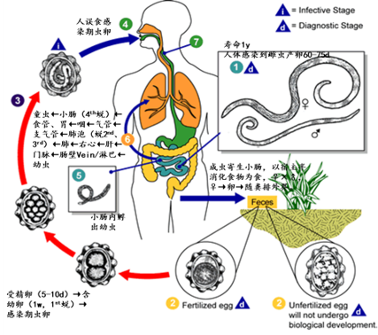

# 人体寄生虫全部背诵内容
根据大纲和达丽老师2024ppt整体，应该是第一个这样的笔记
## 拉丁文

| 中文Chinesefullname | 拉丁 | 第一个词 | 第二个词 |
| --- | --- | --- | --- |
| 溶组织内阿米巴 | *Entamoeba histolytica* | "Ent" (内) + "amoeba" (变形虫) | "histo-" (组织) + "lytica" (溶解的) |
| 结肠内阿米巴 | *Entamoeba coli* | "Ent" (内) + "amoeba" (变形虫) | 来源于“colon”（结肠） |
| 阴道毛滴虫 | ***Tricho**monas vaginalis* | "tricho-" (毛发) + "monas" (单体) | 来源于“vagina”（阴道） |
| **蓝氏贾第鞭毛虫** | *Giardia lamblia* | 以法国科学家Alfred Giard的名字命名 | 以微生物学家Friedrich Lambl的名字命名 |
| 间日疟原虫 | ***Plasmodium** vivax* | "plasma" (等离子) + "modium" (模具) | 拉丁文，意为“活跃的” |
| 恶性疟原虫 | *Plasmodium falciparum* | "plasma" (等离子) + "modium" (模具) | "falci-" (镰刀) + "parum" (带来) |
| 杜氏利什曼原虫 | *Leishmania donovani* | 以英国医生William Boog Leishman的名字命名 | 以印度医生Charles Donovan的名字命名 |
| 刚地弓形虫 | ***Toxoplasma** gondii* | "toxo-" (弓形) + "plasma" (形体) | 来源于发现地突尼斯的北部区域Gondi |
| 华支睾吸虫 | *Clonorchis sinensis* | "clon" (分支) + "orchis" (睾丸) | 来源于“中国”（China） |
| 布氏姜片吸虫 | *Fasciolopsis **buski*** | "fascio" (束状) + "lopsis" (外形) | 以英国医生Busk的名字命名 |
| 卫氏并殖吸虫 | *Para**gonimus** westermani* | "para-" (旁) + "gonimus" (性腺) | 以荷兰医生Westerman的名字命名 |
| 斯氏狸殖吸虫 | *Pagumogonimus skrjabini* | "pagumo-" (狸) + "gonimus" (性腺) | 以俄国寄生虫学家Skrjabin的名字命名 |
| 日本血吸虫 | *Schistosoma japonicum* | "schisto-" (裂) + "soma" (体) | 来源于“日本”（Japan） |
| 猪肉绦虫 | ***Taenia** solium* | 拉丁文，意为“带状” | 拉丁文，意为“猪” |
| 牛肉绦虫 | *Taenia saginata* | 拉丁文，意为“带状” | 拉丁文，意为“牛肉” |
| 微小膜壳绦虫 | *Hymenolepis **nana*** | "hymeno-" (膜) + "lepis" (鳞片) | 拉丁文，意为“微小的” |
| 细粒棘球绦虫 | ***Echinococcus granulosus*** | "echino-" (刺) + "coccus" (球菌) | 拉丁文，意为“颗粒状的” |
| 曼氏迭宫绦虫 | *Spirometra **mansoni*** | "spiro-" (螺旋) + "metra" (子宫) | 以英国医生Sir Patrick Manson的名字命名 |
| 十二指肠钩口线虫 | *Ancylostoma duodenale* | "ancylo-" (钩) + "stoma" (口) | 来源于“十二指肠”（duodenum） |
| 美洲板口线虫 | *Necator americanus* | 拉丁文，意为“杀手” | 来源于“美国”（America） |
| 似蚓蛔线虫 | *Ascaris **lumbricoides*** | 拉丁文，意为“线虫” | 拉丁文，意为“像蚯蚓的” |
| 蠕形住肠线虫 | ***Enterobius** vermicularis* | "entero-" (肠) + "bius" (生活) | 拉丁文，意为“像小虫的” |
| 毛首鞭形线虫 | ***Trichuris** trichiura* | "tricho-" (毛) + "uris" (尾) | 拉丁文，重复词根，意为“毛尾的” |
| 旋毛形线虫 | *Trichinella spiralis* | "tricho-" (毛) + "inella" (小) | 拉丁文，意为“螺旋形的” |
| 班氏吴策线虫 | *Wuchereria **bancrofti*** | 以德国医生Otto Wucherer的名字命名 | 以澳大利亚医生Joseph Bancroft的名字命名 |
| 马来布鲁线虫 | *Brugia **malayi*** | 以荷兰医生Brug的名字命名 | 来源于“马来”（Malaya） |
词根分析由ai生成，不保证释义准确

## 第一篇 总论

**掌握内容:**

\- 寄生虫、宿主、寄生关系的概念。
共生（Symbiosis）:两种不同的生物共同生活的现象
寄生：寄生虫（parasite）宿主（host）。一方受益，另一方受害。
共栖：一方受益，另一方既不受益，也不受害。
互利共生：互相依赖，双方有利。

\- 宿主：终宿主、中间宿主、储存宿主、转续宿主。
终宿主（Definitive host）：寄生虫的成虫（蠕虫）或有性生殖阶段（原虫）寄生的宿主。 
中间宿主（Intermediate host）：寄生虫的幼虫（蠕虫）或无性生殖阶段（原虫）寄生的宿主。
保虫宿主（Reservoir host）：**终宿主除去人**之后剩下的脊椎动物。有些寄生虫成虫既可在人体寄生，又可寄生于某些脊椎动物，后者在一定条件下可将其体内的寄生虫传播给人。在流行病学上，将这些动物称为保虫宿主或储存宿主。
转续宿主（Paratenic host/Transport host）：幼虫侵入非正常宿主后不能发育为成虫，但能存活并**维持幼虫**状态，进入正常终宿主后，仍能继续发育为成虫。这种**非正常**宿主称为转续宿主。

\- 寄生虫的生活史：感染期、感染途径及方式、世代交替、寄生部位及移行途径。
1. 直接发育型：寄生虫直接从人传播到人，不需要中间宿主。土源性蠕虫（钩虫、鞭虫、蛔虫等）
2. 间接发育型：生活史中需要两种及以上的寄主，有中间宿主。生物源性蠕虫（肝吸虫、丝虫等）

\- 寄生虫的致病作用：掠夺营养、机械损害、化学毒素作用。
掠夺营养：养料、血液 
机械损伤：组织损伤、堵塞、机械压迫
化学毒力：抗原刺激、分泌物行为、寄生虫的其它产物等§(1)溶解正常组织；(2)变态反应

\- 寄生虫感染的免疫反应（带虫免疫，伴随免疫）、寄生虫抗原的性质、宿主免疫应答的类型、寄生虫的免疫逃避现象。
寄生虫抗原的特点：复杂性，多源性；属、种、株、期特异性。 
宿主免疫应答的类型：特异性免疫（消除性免疫、非消除性免疫）和非特异性免疫。
带虫免疫（Premunition）：是一种非消除性免疫，对再感染的免疫依赖于体内已有的感染。当用药物将体内的这些原虫杀死，这种免疫也随即消失。
伴随免疫（Concomitant imunity）：是一种非消除性免疫，是一种有效地抗幼虫感染伴随着寄主体内保留成虫感染的状态。如血吸虫病感染。
寄生虫的免疫逃避现象机制：组织学隔离、抗原的变异与伪装、抑制或破坏宿主的免疫应答。

\- 机会致病寄生虫概念。
某些寄生虫感染免疫力正常的宿主时，其毒力、繁殖力等都受到抑制，宿主不表现明显的临床症状。当宿主免疫力下降或服用免疫抑制剂时，寄生虫的毒力等改变，导致宿主发病。这种寄生虫叫做机会致病寄生虫。

**熟悉内容:**

\- 寄生虫：专性寄生虫、兼性寄生虫、体内寄生虫、体外寄生虫等。
长期性寄生虫与暂时性寄生虫 
专性寄生虫、兼性寄生虫和偶然性寄生虫
体内寄生虫与体外寄生虫

\- 各类寄生虫的形态特征、寄生生活对寄生虫形态及生理的影响。
医学原虫学：单细胞构成，如利什曼原虫。
医学蠕虫学：多细胞动物，如吸虫（叶形或舌形）、绦虫（头节、颈节和链体）、线虫（体圆柱形）。  
医学节肢动物学：身体分节，两侧对称，有几丁质外骨骼，成对附肢。

\- 寄生虫的代谢。（内容未提及）

\- 寄生虫病的传播及其特点。
传染源：病人、带虫者、保虫宿主
传播途径：经口、水、食物、土壤、空气、节肢动物及接触传播  
易感者：对某种寄生虫缺乏免疫力或免疫力低下的人群。

\- 寄生虫病流行
基本环节：传染源、传播途径、易感人群。
影响因素：自然因素（温度、湿度、雨量、光照与地理环境等）、生物因素（植物、动物）、社会因素（社会制度、经济状况、文化水平、医疗设施和卫生保健等）。
特点：地方性、季节性、自然疫源性
（人兽共患寄生虫病（Zoonotic disease）概念：在脊椎动物和人之间自然传播的寄生虫病。）

\- 带虫者、隐性感染。
※带虫者（Carrier）：感染某种寄生虫而不显现该种寄生虫病症状的人。
※隐性感染（Suppressive infection）：人体感染寄生虫后，既没有明显的临床表现，又不易用常规方法查获病原体的一种寄生现象。（机会致病寄生原虫— 如肺孢子虫，弓形虫等，在宿主体内通常处于隐性感染状态。）
- 多寄生现象（Polyparasitism）：人体同时感染两种或两种以上的寄生虫
※幼虫移行征Larva migrans概念：一些蠕虫幼虫侵入非正常宿主后，不能发育成成虫，但这些幼虫可在体内长期存活并移行，引起局部或全身病变。

\- 异位寄生。
寄生虫在常规寄生部位以外的部位寄生叫异位寄生，引起的损害叫异位损害。

\- 综合性防治措施: 控制传染源、切断传播途径、保护易感者。
1. 消灭传染源 
2. 切断传播途径
3. 保护易感人群

中国五大寄生虫病分别为：疟疾、血吸虫病、丝虫病、黑热病（内脏利什曼病）和钩虫病
口诀：**虐黑丝雪狗**

## 线虫概论
掌握内容:

生活史及生态:
典型生活史包括阶段:**卵、幼虫、（4次蜕皮）成虫**
生活史类型:直接型(土源性线虫)、间接型(生物源性线虫)
土源性线虫:蛔虫、钩虫、蛲虫、鞭虫等;生物源性线虫:丝虫、旋毛虫等
线虫对人的**感染期:虫卵或幼虫**

原体腔及内部器官的一般特征:

假体腔(原体腔):体壁与消化道之间的腔隙,没有上皮细胞,充满液体,具有营养物质的储藏、运输等功能和支持功能
消化系统:由**口孔、口腔、咽管、中肠、直肠、肛门**组成的完整管道;**三个咽管腺**分泌多种消化酶
生殖系统:雄虫为单管型,由睾丸、储精囊、输精管、射精管及交配附器组成;雌虫为双管型或单管型,由卵巢、输卵管、受精囊、子宫、排卵管、阴道和阴门组成
排泄系统:**管型**(一对长排泄管,有尾感器亚纲)或**腺型**(一个排泄细胞,无尾感器亚纲)

虫卵卵壳的结构:**无卵盖**，由外向内分为**卵黄膜**(受精膜)、**壳质层**(壳质蛋白层)、**脂层**(蛔甙层)三层

体壁的基本结构:
角皮层:具弹性,无细胞结构,具代谢活性,表面光滑有横纹,在虫体前后端或体表衍生出特殊结构
皮下层:由合胞体组成,无细胞界限,主要分泌形成角皮层
纵肌层:由单层排列的肌细胞组成,分多肌型(蛔虫)、少肌型(钩虫)、细肌型(鞭虫)

## 似蚓蛔线虫（Ascaris lumbricoides）
掌握内容:

生活史:

感染：经口（土壤中1）感染期卵
成虫：寄生小肠
幼虫移行：小肠内孵出幼虫→肠壁静脉→门静脉→肝→右心→肺(泡2)→(支)气管咽→小肠(1),期间共蜕皮4次

致病:

**幼虫阶段:一过性肺炎**,症状有发热、咳嗽、痰中带血、哮喘、嗜酸性粒细胞增多
**成虫阶段:主要致病阶段**
- 掠夺营养和破坏肠粘膜影响吸收
- 超敏反应
- **并发症（钻孔习性）：喜酸怕碱**：肠梗阻、胆结石、胰腺炎等

实验诊断:
**虫卵：直接涂片法(常用)**，饱和盐水浮聚法，水洗沉淀法检查虫卵
**成虫，痰中幼虫**

易于传播的重要因素:生活史简单,雌虫产卵量大,虫卵抵抗力强,不良耕作及卫生习惯
药物**阿苯达唑（肠虫清）、甲苯达唑**

## 毛首鞭形线虫（Trichuris trichiura）

掌握内容:

生活史:
成虫主要寄生在盲肠
感染:经口感染期卵

致病:
掠夺营养和破坏肠粘膜影响吸收
轻度感染时一般无明显症状
严重感染可出现直肠脱垂

诊断参考蛔虫。

#### 钩虫：十二指肠钩口线虫（Ancylostoma duodenale）美洲板口线虫(Necator americanus)  

**掌握内容:**

- 生活史：
  - 感染途径：**丝状蚴（感染期蚴）**向温性，**主动钻入皮肤**（直接口吞，生肉，胎盘母乳），经血循环进入肺（**血肺移行**），再经**气管、咽进入小肠**
  - 十二指肠钩虫幼虫有"迁延移行现象"，指十二指肠钩虫的钩蚴经皮肤感染人体后，部分在进入小肠之前，可滞留于某些组织中达很长时间（此时，虫体发育缓慢或 “暂停发育” ），在受到某些刺激后，才陆续到达小肠发育成熟。
  - 成虫寄生在小肠上段
  - 终宿主：自然情况仅人；（转续宿主：A. d.-牛、羊、猪、兔、狮子和老虎； N. a.- 猴和猩猩）
  - 虫卵随粪便排出，在潮湿、荫蔽、通风、温暖环境下发育为丝状蚴
  - 主要通过皮肤感染，其他感染方式包括经口、经胎盘、母乳等

- 致病：
  - 幼虫
    - 钩蚴性皮炎（粪毒，I型变态）
    - 一过性钩蚴性肺炎
  - 成虫※：
    - 消化道症状
    - 低色素小细胞型贫血（※齿咬破肠粘膜损伤血管（不断更换啃咬部位），头腺分泌抗凝素，以血为食，血消化道排出；宿主蛋白质铁缺乏）
    - 异嗜症
    - 嗜酸性粒细胞增多症
    - （十二指肠钩虫）婴儿钩虫病（贫血）
    - 其他症状：生长发育障碍、闭经、阳痿、早产、死胎
  
- 实验诊断：
  - 粪便直接涂片法和 **（高效常用）饱和盐水浮聚法**查虫卵
  - 钩蚴培养，改良加藤计算虫卵，痰中查钩蚴，胃镜查成虫
  - 免疫学

**熟悉内容:**  

- 形态特征：
  - 成虫呈C形或S形，有发达的口囊、咽腺和头腺，雄虫有交合伞和交合刺，两种钩虫可通过背辐肋和交合刺形态区分
  - 头腺1对：抗凝血酶原作 用，阻止宿主肠壁伤口的血液凝固，有利于钩虫的 吸血；
  - 咽腺3个：降低宿主肠壁的蠕动，有 利于虫体的附着
  - 排泄腺1对：抑制宿主血液的凝固
  - 虫卵卵圆形，卵壳薄透明，卵内细胞与卵壳间有明显空隙，排出时已分裂为2-4细胞
  - 两种钩虫主要的鉴别特征
  

#### 蠕形住肠线虫（Enterobius vermicularis） 

**掌握内容:**

- 生活史：
  - 成虫寄生在盲肠、阑尾、结肠、直肠及回肠下段
  - 雌虫在夜间(?)爬出肛门在肛周皮肤皱褶处产卵
  - 感染：感染期卵经口、呼吸道及肛门。主要通过自体感染(肛-手-口)传播，也可经呼吸道或逆行感染
  
- 致病：  
  - 损害肠黏膜、肛周瘙痒、阑尾炎、异位损害（蛲虫性泌尿生殖系统炎症）

- 实验诊断：
  - 透明胶纸拭擦法检查虫卵，在早晨洗澡或排便前进行

**熟悉内容:**

- 流行与防治原则：  
  - 世界性分布，感染率在儿童尤其是住宿学校儿童中很高，城市多于农村
  - 注意个人卫生如勤剪指甲、饭前便后洗手，加强环境消毒
  - 药物治疗可用阿苯达唑，外用药膏可缓解肛周瘙痒

#### 丝虫：班氏/马来丝虫；班氏吴策线虫（Wuchereria bancrofti）马来布鲁线虫（Brugia malayi） 

**掌握内容:**

- 生活史：
    - 卵胎生
    - 感染：**（班：淡色库蚊；马：中华按蚊）蚊叮刺吸血**，**丝状蚴**（感染期幼虫）主要经皮肤感染
    - 成虫寄生淋巴：班：深部淋巴（下肢、阴囊、腹股沟、肾盂等部位），马：人猴猫四肢浅部淋巴系统
    - 微丝蚴夜现周期性：微丝蚴在外周血液中夜多昼少，白天滞留在肺毛细血管中，夜晚出现于外周血液。高峰时间：W. b. 10PM-2AM，B. m. 8PM-4AM
    - 幼虫在蚊体内发育：腊肠期幼虫 → 丝状蚴，蜕皮两次，只发育，不增加数量

- 致病：
    - 微丝蚴血症：外周血可出现微丝蚴，症状不明显或有淋巴系统炎症和偶尔发热
    - 急性淋巴丝虫病
      - 淋巴**结炎**（腹股沟和股部淋巴结肿大）和**逆行**性淋巴**管炎**（流火）（出现丹毒样皮炎）
      - 精索炎、附睾炎、睾丸炎（班氏丝虫）
      - 丝虫热
    - 班氏丝虫病的三大并发症（慢性）：
      - 象皮肿（**生殖系统仅班氏；四肢均有**）（淋巴管阻塞导致高蛋白淋巴液流入周围组织，刺激组织增生、纤维化）
      - 鞘膜积液（精索、睾丸淋巴管阻塞，淋巴液流入鞘膜腔）
      - 乳糜尿（主动脉前或肠干淋巴结阻塞，乳糜液溢入尿中）
    - **隐性丝虫病**：低热、咳嗽、哮喘、**热带嗜酸性粒细胞增多**等，由宿主对微丝蚴抗原引起的Ι型超敏反应
    - 异位寄生（班氏多见）

- 实验诊断：
    - 外周血查微丝蚴：新鲜血滴检查法、厚血膜法（最常见）；乳糜尿 
    - 免疫诊断：皮试、检测抗体、检测抗原

海群生

#### 旋毛形线虫（Trichinella spiralis）

卵胎生，生殖系统雌雄均为单管性。

**掌握内容:**

- 生活史：
    - 人感染：口食入含活**囊包幼虫**横纹肌肉类 
    - 发育过程：囊包幼虫在小肠内脱囊发育为成虫（？），交配产新生蚴进入血循环到达横纹肌形成囊包
    - 宿主转换：两个宿主（如猪→人）。保虫宿主：许多哺乳动物，自然疫源性

- 致病：
    - 侵入期（肠道期）：幼虫在小肠脱囊发育为成虫，导致肠粘膜炎症，出现发热、恶心、腹痛、腹泻等  
    - 幼虫移行期（肠外期）：幼虫移行到横纹肌，出现高热、**肌肉酸痛**，严重时呼吸、咀嚼、吞咽困难，心肌受累可致死
    - 成囊期（恢复期）：炎症介质和疤痕组织形成，轻度感染者逐渐恢复，重者可致命

- 实验诊断：
    - 询问吃生肉或加工不熟的肉的经历
    - 肌肉活检：取腓肠肌压片
    - 剩余肉镜检
    - 接种实验动物
    - 免疫方法

欧美国家发病率较高，阿苯达唑，甲苯达唑

### 吸虫概论

**掌握内容:**
- 吸虫生活史的一般规律：
  - 卵只能在水中才能继续发育
  - 在吸虫的生活史中需要一种或两种中间宿主，淡水螺类是主要的第一中间宿主
  - 世代交替：胞蚴－雷蚴－尾蚴的生殖过程是无性生殖，有性生殖在成虫中进行
  - 多数吸虫的感染阶段是囊蚴，经口感染；一些吸虫的感染阶段是尾蚴，经皮肤感染
  - 多数种类有保虫宿主
  - 吸虫的生活史一般模式（肝吸虫）：卵（Egg）、毛蚴（Miracidium）、胞蚴（Sporocyst）、雷蚴（Redia）、尾蚴（Cercaria）、囊蚴（Encysted metacercaria）、童虫（metacercaria）、成虫（Adult fluke）
    - 肺吸虫、姜片虫（母/子雷蚴）；血吸虫（母/子胞蚴）

**熟悉内容:**
- 吸虫的一般形态：
  - 成虫：背腹扁平，舌叶状（血吸虫丝状），大小因种而异，两侧对称，不分节 
  - 吸盘：口吸盘和腹吸盘；吸附和运动
  - 没有体腔
  - 体壁：
    - 皮层：外质膜，基质和基质膜 
    - 外环肌和内纵肌
    - 皮层细胞(Syncytium)
    - 功能：保护、营养吸收和感觉等
  - 消化系统：不完全消化管道：口、咽、食道、二分叉的肠支
  - 生殖系统：
    - 雌性：卵巢、输卵管、梅氏腺、卵模、卵黄腺和卵黄管、子宫、受精囊、劳氏管
    - 雄性：睾丸、输出管、输精管、储精囊、阴茎囊、前列腺、阴茎  
  - 排泄系统：火焰细胞和排泄管构成Protonephridial系统？？？？？？
  - 神经系统：咽两侧各有一神经节（神经中枢），两神经节各发出前后三条神经干，各神经干在不同的水平上有横索相连，形成阶梯状神经索

#### 华支睾吸虫（Clonorchis sinensis）
**掌握内容:**
- 生活史：
  - 成虫寄生部位：肝胆管
  - 感染阶段：囊蚴 
  - 感染途径：食入生的或未充分烹饪的含囊蚴的淡水鱼虾
  - 终宿主：人及食肉的哺乳动物  
  - 第一中间宿主：淡水螺（豆螺、沼螺、涵螺等）
  - 第二中间宿主：淡水鱼虾
  - 保虫宿主：包括猫、狗、猪及鼠等（吃鱼的哺乳动物）
  - 在人体内的移行：口 → 十二指肠 → 胆总管/血管/腹腔 → 胆管
- 致病：
  - 华支睾吸虫病：主要是成虫寄居导致肝脏受损、肝功能障碍，病变主要发生于肝脏的次级胆管
  - 致病原因：虫体机械性刺激作用；虫体阻塞作用；虫体代谢产物和分泌物作用 
  - 重度感染的主要临床表现：胆管壁增生、胆管癌、胆结石、肝硬化、腹水、侏儒症
- 实验诊断：
  - 病原体检查：
    - 从粪便中（约75%）：直接涂片法、改良加藤氏法、沉淀集卵法  
    - 十二指肠引流胆汁法（95.7%）
    - 口服胶囊法

**熟悉内容:**  
- 形态特征：
  - 成虫：身体扁平，体形狭长，前端稍窄，后端钝圆，（10-25）mm×（3-5）mm；口吸盘略大于腹吸盘
  - 雌雄同体：♂一对前后排列的分支状睾丸，位于虫体后部三分之一处；♀卵巢，受精囊，子宫，卵黄腺；无阴茎，阴茎囊和前列腺
  - 卵：感染人体的蠕虫卵中最小的，（29×17）um，淡黄褐色，一端较窄且有盖，卵盖周围的卵壳增厚形成肩峰，另一端有小瘤。从粪便中排出时已含有毛蚴
  - 囊蚴：虫体失去了幼虫的一些器官，如眼点、尾等。圆形的囊具有很厚的壁，囊内有童虫，童虫可见口、腹吸盘，部分肠管和排泄囊。这是华支睾吸虫的感染阶段
- 流行与防治：
  - 分布：中国、日本、朝鲜及越南；我国除青海、甘肃、宁夏、新疆、内蒙、西藏外，其他各省市均有。华东地区感染率5-15%，个别地区达到46% 
  - 传播：
    - 传染源：病人、带虫者及有大量的保虫宿主
    - 中间宿主：广泛存在  
    - 感染途径：经口
    - 原因：粪便处理不当；**不良饮食习惯**（吃生鱼、腌鱼、烟熏鱼和干鱼）
  - 防治：
    - 药物治疗：吡喹酮，阿苯哒唑
    - 充分烹饪淡水鱼，生熟分开
    - 粪便无公害处理
    - 灭螺

### 卫氏并殖吸虫（Paragonimus westermani）斯氏狸殖吸虫（Pagumogonimus skrjabini）

**掌握内容:**

生活史：
- 虫卵在外界的发育: 虫卵随带虫者或病人的粪便或痰液进入淡水中，在适宜条件下孵化为毛蚴。？？？？？？？？？
- 幼虫在第一中间宿主体内的增殖: 毛蚴侵入螺类（如川卷螺）体内，经胞蚴、雷蚴发育为尾蚴。
- 第二中间宿主: 尾蚴离开螺体游入淡水蟹或蝲蛄等甲壳动物体内，包囊形成囊蚴。
- 感染阶段及人体感染方式: （终宿主：人及食肉哺乳动物；转续宿主：猪）食用生的或未充分烹饪的含囊蚴的淡水蟹或蝲蛄而被感染。
- **童虫在人体内的移行**see: 囊蚴在小肠脱囊为幼虫，幼虫侵入肠壁，进入腹腔，经肝、横膈进入胸腔，再侵入肺脏组织，亦可进入脑等其他部位。
- 成虫寄主部位: 主要在肺部形成囊肿。

致病：
- 致病机理为机械性损伤和虫体抗原引起的免疫病理损伤。急性期：幼虫移行、窜扰的机械损伤和超敏。慢性期：有脓肿期、囊肿期和纤维疤痕期。
- 主要临床分型: 胸肺型（最常见）、腹型、皮下包块型、脑脊髓型、亚临床型，其他类型？？

实验诊断：
- 病原检查: 痰、粪便查虫卵；皮下包块查虫体。
- 免疫学检查: 皮试（初筛）、ELISA等。

吡喹酮治疗。
对斯氏狸殖吸虫（终宿主：果子狸，人体内很少发育为成虫；治病：幼虫移行症：皮肤性、内脏型）
**熟悉内容:**

形态特征：
- 两种并殖吸虫成虫外形及内部结构的鉴别要点:
  - 卫氏并殖吸虫: 体形椭圆，体宽与体长之比约1:2；口腹吸盘大小相近，腹吸盘位于腹面中部靠前；卵巢有5-6个分支。
  - 斯氏狸殖吸虫: 体形窄长，体宽与体长之比约1:2.4-3.2；口吸盘略小于腹吸盘，腹吸盘位于体前三分之一处；卵巢分支多。
- 虫卵、尾蚴和囊蚴的外形和结构特点:
  - 虫卵: 卵圆形，一端略尖，卵壳厚，含卵细胞和卵黄细胞。
  - 尾蚴: 微尾型。
  - 囊蚴: 球形，有双层囊壁，内有一个发育成熟的幼虫。

流行与防治：
- 并殖吸虫在我国的分布概况: 
  - 卫氏并殖吸虫分布广泛，全国各地均有。
  - 斯氏狸殖吸虫仅在中国分布。
- 流行的主要因素: 食用生的或未煮熟的含囊蚴的淡水蟹、蝲蛄或转续宿主（如蛙、鼠等）肉制品；饮用受污染的生水；第一、第二中间宿主广泛分布；粪便随意排放污染水域等。

#### 布氏姜片吸虫(Fasciolopsis buski)
**熟悉内容:**
- 成虫形态
- 虫卵形态：是吸虫中最大的卵，130-140 × 80-85 um， 有一个小的卵盖，卵壳薄
- 带虫者：轻度感染可无症状。
- 消化道功能紊乱：中度感染。成虫吸附在小肠上段的粘膜上，虫体较大，吸盘发达，吸附力强，造成机械性损伤；代谢产物被吸收后可引起超敏反应。
- 合并症：重度感染。肠梗阻，消瘦...，儿童侏儒症
- 诊断：粪便直接涂片法，虫卵浓集法，粪便中有成虫，加藤虫卵计数，ELISA,IFA
- 流行：生食水生植物的习惯，中间宿主（扁卷螺）及媒介植物广泛存在，（人猪）粪污染水源
- 吡喹酮

#### 日本血吸虫（Schistosoma japonicum）

**掌握内容:**

- 生活史：
  - 雌雄异体，但通常呈合抱状态。
  - 感染：皮肤接触尾蚴疫水（向光性，向温性，主动钻入终宿主皮肤）
  - 童虫经皮下小血管或淋巴管进入静脉系统，经右心、肺、左心进入肠系膜动脉，毛细血管，再进入肝内门静脉，雌雄合抱并进一步发育，**成虫寄生于终宿主人的门脉-肠系膜静脉**、发育成熟产卵。（**牛重要的保虫宿主**）
  - 虫卵大部分沉积于肠壁小血管内（60%），肝内门静脉（22%），很小一部分沉积于肺和脑（2%），还有一小部分随粪便排出体外（16%）。
  - 虫卵堆积在静脉使静脉内压增加。肠蠕动（推）、腹内压（压）和血管内压（挤）。沉积于肠组织的虫卵，由于卵内毛蚴分泌的蛋白酶透过卵壳，破坏血管壁，使周围组织发炎坏死。坏死组织向肠腔溃破，虫卵随坏死组织落入肠腔，随粪便排出体外。
  - 虫卵随粪便排出体外后在水中孵化成毛蚴，毛蚴在水中游动，感染**中间宿主钉螺**体内发育为尾蚴。

- 致病：
  - 尾蚴：尾蚴性皮炎，表现为丘疹、瘙痒。
  - 童虫：肺部血管炎，表现为发热、咳嗽、痰中带血、嗜酸性粒细胞升高。 
  - 成虫：机械损伤-静脉内膜炎，免疫复合物疾病如肾小球肾炎。
  - 虫卵（最主要的致病因子）：SEA再次刺激机体产生各种淋巴因子，引起L、M、E、N 聚集于虫卵周围产生Ⅳ变态反应——形成虫卵肉芽肿。Hoeppli phenomenon：虫卵周围出现许多浆细胞，浆细胞分泌抗体与抗原结合，在虫卵周围形成红色棒状辐射物，称为何博礼现象（III变态）。
抗原抗体复合物形成产生Ⅲ型变态反应出现Hoeppli现象。可引起肉芽肿。虫卵周围可见浆细胞聚集形成Hoeppli现象。虫卵肉芽肿可致肝纤维化，导致肝硬化、门脉高压。 

- 临床表现：
  - 急性血吸虫病（初次）：发热、咳血痰、腹痛、腹泻、粘液血便、肝脾肿大。
  - 慢性血吸虫病（轻度重复感染）轻者无症状，有症状者：腹痛、腹泻、粘液血便、肝脾肿大、贫血、消瘦等。
  - 晚期血吸虫病：巨脾、腹水、结肠增殖、侏儒等。
  - 异位血吸虫病：肺（急性虫卵超敏）；脑（急性脑膜脑炎，慢性肉芽肿颅内占位病变）

- 实验诊断：
  - 病原检查：粪便：直接涂片法、毛蚴孵化法、改良加藤法查什么？。直肠粘膜组织压片检查虫卵。  
  - 免疫诊断：皮内试验（IDT）、间接血凝（IHA）、酶联免疫吸附试验（ELISA）、环卵沉淀试验（COPT）、尾蚴膜反应（CHR）。

- 流行与防治原则：
  - 疫区分型：湖沼、山丘、水网
  - 传播途径三大环节：虫卵入水、钉螺孳生、接触疫水

**熟悉内容:**

- 形态特征：成虫外形，口吸盘、腹吸盘的位置及特点。雄虫抱雌沟、睾丸；雌虫卵巢、子宫。成虫体壁的超微结构。虫卵、尾蚴的形态特点。
- 形态特征：
  - 成虫：雄虫体扁平呈叶状，长约11～20mm。体前端有口吸盘，食道短，肠管分叉。腹吸盘位于颈后。后体1/3 有6～9个睾丸，精子经输精管汇合于生殖孔。雌虫常寄居于雄虫的抱雌沟内。雌虫细长，长20～25mm，腹吸盘大于口吸盘。生殖器官由卵巢、卵黄腺、卵模、梅氏腺、子宫等组成。肠管呈黑褐色。
  - 虫卵：侧刺，
  - 尾蚴：叉尾型。

- 免疫：
  - 虫卵内毛蚴分泌可溶性虫卵抗原SEA释放

### 绦虫概论

**掌握内容:**
- 生活史: （孕节）虫卵---六钩蚴---中绦期(中间宿主)---成虫(终宿主)
- 绦虫在中间宿主体内发育的时期称为中绦期（metacestode）或续绦期，有多种幼虫形式。
  - 圆叶目: （孕节）虫卵 - 六钩蚴 - 囊尾蚴 - 似囊尾蚴 - 棘球蚴 - 成虫 
  - 假叶目: 虫卵 - 钩球蚴 - 原尾蚴 - 裂头蚴 - 成虫

**熟悉内容:**
- 线虫没有附着器官，只有线虫有假体腔
- 消化管道：线虫完整；吸虫不完整；绦虫没有（体表的微毛）
- 绦虫的一般形态:
  1. 普遍特征
    - 多数成虫寄生在脊椎动物的小肠内；
    - 身体扁平，长带状，身体分节，两侧对称，大小因种而异
  2. 成虫形态！！
    (1) 头节：
      - 4个杯状吸盘，1个顶突，上有小钩 
      - 2个吸槽
    (2) 颈节：
      - 细短，不分节，由胚细胞组成，具生发功能  
    (3) 链体: 分节，3-4个或上千个
      - 未成熟节片（幼节）
      - 成熟节片（成节）：雌、雄性生殖器官各一套均成熟
      - 妊娠节片（孕节）：子宫极度发达，充满虫卵，其余器官退化
  3. 成虫内部结构
    (1) 体壁 ！！
      a. 皮层：微毛，基质，基膜
      b. 皮下层：环肌，纵肌，核周体，石灰小体
    (2) 神经系统：头节中有一神经节，发出6根纵行神经干，感觉末梢分布于皮质
    (3) 排泄系统：焰细胞，4根排泄管
    (4) 生殖系统：（**绦虫雌雄同体**，成节雌、雄性生殖器官各一套均成熟）
      - 雄性生殖系统：睾丸，输出管，输精管，阴茎囊，射精管，阴茎  
      - 雌性生殖系统：生殖腔，阴道，输卵管，卵巢，卵模，卵黄腺，卵黄总管，梅氏腺，子宫

#### 猪肉绦虫（Taenia solium）牛肉绦虫（Taenia saginata）

**掌握内容:**
- 生活史：
- 
  - 成虫寄生部位：人小肠上段，人是两绦虫唯一的终宿主。
  - 虫卵（孕节）被中间宿主（猪/牛、人）吞食小肠消化液作用胚膜破裂六钩蚴逸出，钻小肠壁经血循环或淋巴到各处发育（主运动多的肌肉）成囊尾蚴
  - 人食用含囊尾蚴的生的或未充分烹饪的猪肉，囊尾蚴胆汁刺激翻出头节附着肠壁，发育成虫排卵。
- 致病：
  - 猪囊尾蚴病：吞食虫卵（孕节）
    - 三种感染方式：异体感染，自体外感染，自体内感染
    - 皮下和肌肉型（多数无症状，皮下结节，发热，嗜酸性粒细胞升高，假性肌肥大）
    - 脑囊尾蚴病：颅内高压、癫痫、精神症状（三大症状）
    - 眼囊尾蚴病
  - 猪带绦虫病：吃含囊尾蚴生猪肉：无症状或症状较轻
  - 牛带绦虫：一般无症状，肛周瘙痒，偶肠梗阻

**熟悉内容:**
- 形态特征：
  - 复习比较：两种成虫头节、链体的组成及结构特点：头节有四吸盘，T. solium有顶突和小钩，T. saginata无；链体由大量节片组成，T. solium约700-1000节，T. saginata约1000-2000节；成节T. solium卵巢三叶，T. saginata两叶；孕节T. solium两侧分支7-13个，分支不规则，T. saginata分支规则，每侧15-30个。
  - 虫卵及囊尾蚴的形态：虫卵球形，内含六钩蚴；囊尾蚴为白色半透明囊状物，T. solium可寄生人体，有顶突和小钩，T. saginata一般不寄生人。
- 实验诊断：
  - 粪便涂片查虫卵或直接查孕节片诊断绦虫病。
  - 手术、影像学、眼底镜等检查活组织中的囊尾蚴。
- 流行与防治：
  - 绦虫病：南瓜子，槟榔
  - 囊尾蚴：吡喹酮，手术

#### 细粒棘球绦虫（Echinococcus granulosus）

**掌握内容:**

- 生活史：
  - 成虫形态：是医学寄生虫中最小的绦虫，长2-7 mm。头节略呈梨形，具有顶突（上有两圈小钩），４个杯状吸盘。颈节具生发功能。链体有１个幼节、１个成节、１个孕节。
  - 棘球蚴结构及功能：球形，囊状，直径为2－35 cm。囊壁包括角质层和生发层。囊内容物包括原头蚴、生发囊、子囊和孙囊、囊液。
    - 原头蚴（原头节）由生发层产生，形似成虫的头节，但体积小、缺顶突腺。
    - 不育囊：无原头蚴生发囊的母囊
    - 棘球蚴液有抗原性
    - 棘球蚴砂：壁上脱落悬浮囊液的原头蚴、生发囊、小的子囊
  - 终宿主：**狗**，狼。中间宿主：**人、羊**、牛、骆驼
  - 人体感染棘球蚴的主要方式：经口摄入虫卵（孕节）被感染。
  - 棘球蚴的发育：六钩蚴在十二指肠内孵出，钻入肠壁，随血流至全身组织发育成棘球蚴。？？
- 致病
  - 棘球蚴的机械损害：通常寄生肝肺，有时可寄生在肾、脾，或脑，危害很严重，并且通常是致命的。压迫邻近组织细胞，引起寄生部位周围组织细胞的萎缩和坏死。
  - 临床表现：棘球蚴液毒性过敏、囊破继发感染、局部压迫刺激

**熟悉内容:**

- 形态特征：虫卵与带绦虫卵相似，光镜下难以区别。
- 实验诊断：
  - 免疫学检查：皮内试验阳性；血清学试验如ABC-ELISA，ELISA，IHA等是重要的辅助诊断方法。
  - 病原检查：手术摘除棘球蚴是确诊方法；X-ray，CT，超声波检查，同位素扫描对诊断和定位有重要价值。
- 流行与防治：
  - 棘球蚴病在我国的分布：世界性分布，牧区为主要流行区，学龄前儿童最易感染。
  - 与畜牧业、皮毛加工业的关系：狗吞食含棘球蚴的羊内脏等是重要的流行因素。防治措施包括给狗定期驱虫，不喂生的动物内脏，注意个人卫生等。
  - 首选手术摘除；阿苯达唑，吡喹铜

#### 曼氏迭宫绦虫（Spirometra mansoni）

**掌握内容:**

- 生活史及感染阶段，人在其生活史中的角色：
  - 生活史：虫卵入水3-5周发育为钩球蚴，被第一中间宿主剑水蚤摄食发育为原尾蚴；第二中间宿主如蝌蚪（蛙）、人摄食剑水蚤后，原尾蚴在体内发育为裂头蚴；终宿主如猫、狗、人等摄食含裂头蚴的第二中间宿主后，在小肠内发育为成虫；转续宿主如蛇、鸟、猪等。
  - 人在其生活史中的角色：人可作为第二中间宿主和终宿主。（原尾蚴和裂头蚴都具有感染性。感染方式包括：用被裂头蚴感染的蛙肉做湿敷剂，裂头蚴能钻穿皮肤使人感染；生吃含裂头蚴的蛙、蛇等；饮用含有被原尾蚴感染的剑水蚤的水；原尾蚴可从皮肤侵入人体。）
- 裂头蚴病的临床分型：
  - 皮下 裂头蚴病
  - 眼 裂头蚴病
  - 脑脊髓 裂头蚴病
  - 口腔、颌面部 裂头蚴病
  - 内脏 裂头蚴病

**熟悉内容:**

- 简介成虫、裂头蚴和虫卵形态特征：
  - 成虫：头节指状，具有２个吸槽；颈节细长具生发功能；链体有1000节片，成节和孕节相似；雌雄生殖孔和子宫孔位于节片的中部，卵黄腺滤泡状，子宫位于卵巢前。
  - 裂头蚴：乳白色，带状，约300 mm长，头端较膨大，尾端较细，体前端无吸槽，中央有一明显凹陷，头节与成虫的相似，身体不分节。
  - 卵：椭圆形，浅灰褐色，卵壳较薄，一端有卵盖，内有一个卵细胞和多个卵黄细胞。

**学时分配:** 4

#### 微小膜壳绦虫（Hymenolepis nana）

**熟悉内容:**

- 简介形态、生活史的特征及自体感染现象、致病与病原诊断。

成虫寄生在人和啮齿类小肠
感染阶段：卵，似囊尾蚴
感染方式：经口
感染途径：
- 直接感染（不经中间宿主）：成虫寄生在终宿主体内，脱落的孕节破裂，释放出虫卵，随宿主粪便排出体外，被同一宿主或其他终宿主吞食。
- 自体内感染（不经中间宿主）：孕节释放出的虫卵在肠腔内停留时间较长，可孵出六钩蚴。
- 间接感染（需中间宿主）：终宿主因误食含有似囊尾蚴的中间宿主而感染。
虫卵→六钩蚴→似囊尾蚴（肠绒毛）→成虫

通常无症状、消化不良等。
查粪便中的虫卵
吡喹酮

#### 原虫概论
**掌握内容:**
- 生理特征：运动与摄食、生殖方式的类型。
  - 运动：伪足、鞭毛、纤毛
  - 摄食：渗透、胞饮、吞噬
  - 无性生殖: 二分裂、多分裂、出芽生殖
  - 有性生殖：接合生殖、配子生殖

**熟悉内容:**
- 形态特征：胞膜、胞质及细胞器、胞核及类型。
  - 细胞膜（表膜、质膜）：使虫体保持一定的形状, 具有抗原性；参与虫体的营养、排泄、运动、感觉、侵袭及逃避宿主免疫效应等活动
  - 细胞质：由基质（内质和外质）、细胞器、内含物组成
  - 细胞器：普通细胞器（线粒体、高尔基复合体、内质网、溶酶体等）和特殊细胞器（伪足、鞭毛、纤毛、胞口、胞咽、胞肛、顶端复合体、丝状伪足等）
  - 胞核类型：泡状核和实质核
- 生活史类型及致病特征。  
  - 生活史类型：人际传播型、人与动物间传播型（循环传播型）、虫媒传播型
  - 致病特点：增殖致病、播散能力、毒素致病、机会致病

#### 溶组织内阿米巴（Entamoeba histolytica）
**掌握内容:**
- 形态及生活史特征
  - 滋养体：组织型大滋养体和肠腔型小滋养体
  - 包囊：单核包囊、双核包囊、四核包囊（具传染性）
  - 生活史：四核包囊经口感染，在肠内脱囊为肠腔性小滋养体，寄生于结肠，以二分裂增殖。包囊随粪便排出体外发育；肠腔型小滋养体随稀水样便排出死亡；侵入组织的组织性大滋养体侵肝肺脑。
- 致病：滋养体侵袭组织的过程及机理,肠阿米巴病和肠外阿米巴病的病变特点和好发部位,主要临床表现。
  - 致病机制：细菌增强毒力，特定株的致病力决定是否侵入组织。阿米巴凝集素（介导吸附肠上皮）、穿孔素、半胱氨酸蛋白酶破坏宿主组织，吞噬死的宿主细胞，免疫力下降
  - 病理变化：滋养体烧瓶样溃疡，好发于盲肠、阑尾（乙状结肠，升结肠，回肠）
  - 临床表现：肠阿米巴病（带虫者、急性痢疾、慢性阿米巴病：间歇腹痛、并发症：阿米巴肿）和肠外阿米巴病（血行转移；阿米巴肝肺脑脓肿，皮肤尿道子宫阿米巴病）
- 实验诊断：病原检查（粪便及组织检查，人工培养）、免疫诊断。
  - 粪便：生理盐水涂片查滋养体（急性），碘液涂片（慢性）/硫酸锌漂浮查包囊
  - 组织检查：肝脓肿穿刺液查滋养体
  - 人工培养：Robinson' culture medium 
  - 免疫诊断：ELISA，IFA，IHA等
  - 影像：B超，CT,MRI
  - 核酸特异引物

**熟悉内容:**
- 理化及生物因素对阿米巴发育、增殖的影响。
- 流行因素及防治原则：传染源、传播方式。
  - 传染源：慢性病人及带虫者
  - 传播途径：包囊污染食物、饮水
  - 防治：控制传染源、切断传播途径、个人及环境卫生
  - 肠（外）阿米巴：甲硝唑，替硝唑；
  - 带虫者：巴龙霉素、喹碘方

#### 结肠内阿米巴（Entamoeba coli）
**熟悉内容:**
- 包囊较大，核数1-8个，拟染色体呈草束状
- 致病性自生生活阿米巴的感染方式和致病特点。

以下是根据您提供的大纲提取的相关内容:

#### 杜氏利什曼原虫（Leishmania donovani）

**掌握内容:**

- 生活史：
  - 人巨噬细胞：无鞭毛体
  - 雌白蛉体内发育：前鞭毛体
  - 感染阶段及方式：前鞭毛体，白蛉吸血
- 致病！！！！！：
  - 病理：无鞭毛体在巨噬细胞里增殖，造成巨噬细胞大量破坏和增生。受累器官组织：肝、脾、骨髓、淋巴结等
  - 内脏利什曼病(visceral leishmaniasis)：长期不规则发热、肝脾淋巴结肿大、全血细胞贫血、白蛋白/球蛋白比例倒置、蛋白尿和血尿、鼻和齿龈出血、并发症
  - 我国黑热病的特殊表现型：黑热病后皮肤利什曼病、淋巴结型黑热病、皮肤利什曼病
- 实验诊断：
  - 病原学检查：穿刺物涂片法（骨髓、淋巴结、脾）查无鞭毛体；穿刺物培养法NNN培养基查前鞭毛体、穿刺物接种动物法、外周血涂片、皮肤活检组织检查
  - 免疫诊断：ELISA、IHA等；
  - 分子生物学检查法：PCR、DNA探针
- 我国黑热病的流行特征：人源型（平原型）、犬源型（山丘型）、自然疫源型（荒漠型）
- 锑剂，戊烷脒，硝呋太尔

**熟悉内容:**

- 形态特征：
  - 无鞭毛体：卵圆形、虫体很小（2-3μm）、有一较大圆形核、动基体位于核旁细小杆状、高倍镜下可见基体和根丝体
  - 前鞭毛体：虫体呈梭形、大小为10～20μm×1.5-4μm、核位于虫体中部、动基体在前部、基体发出一鞭毛（长与虫体相近，弯曲）、在培养基内常以虫体前端聚集成团（排列成菊花状）
- 流行与防治原则：
  - 传染源：病人、病犬、感染犬、野生动物
  - 传播媒介：白蛉
  - 防治：治疗病人、控制病犬、消灭白蛉、加强个人保护

#### 蓝氏贾第鞭毛虫（Giardia lamblia）

**掌握内容:**

- 生活史特征：
  - 成熟四核包囊（感染期）随污染食品、水，经口食入
  - 脱囊（十二指肠）
  - 滋养体（繁殖阶段）寄生于十二指肠（吸盘吸附）、胆囊，纵二分裂繁殖
  - 成囊（回肠下段或结肠）（传播阶段，外界抵抗力强）
  - 包囊随粪便排出，污染食物和饮水
- 寄生部位、发育增殖：主要寄生在十二指肠内，借吸盘吸附肠壁；繁殖阶段为滋养体，二分裂法
- 带虫状态及急慢性期表现：
  - 带虫者：13~17%
  - 急性期：发热、乏力、恶心、厌食、腹痛、腹泻，恶臭水样便，上中腹痉挛疼痛，吸收不良，脂肪泻等
  - 慢性期：胆囊炎或胆管炎，表现为周期性稀便，反复发作，大便甚臭，病程可长达数年；儿童患者可由于腹泻、脂肪泻，引起贫血等营养不良，导致生长滞缓

**熟悉内容:**

- 滋养体、包囊的形态：
  - 滋养体：呈半个倒置梨形，两侧对称，背凸腹平，腹面前半部向内凹陷成吸盘；4对鞭毛，分为前、后侧、腹、尾鞭毛各1对；1对细胞核位于吸盘底部；1对轴丝；1对半月形中体与轴柱1/2相交
  - 包囊：椭圆形，大小为10-14×7-10μm，囊壁较厚，囊壁与虫体间有明显空隙；未成熟包囊2个核，成熟包囊4个核，多偏向一端；可见鞭毛、丝状物、轴柱
- 实验诊断：粪便检查（滋养体：生理盐水涂片；包囊：碘液涂片）、小肠液检查、小肠活体组织检查、免疫诊断（ELISA、IFA、CIE等）
- 甲硝唑（灭滴灵）、替硝唑
  
#### 阴道毛滴虫（Trichomonas vaginalis）

**掌握内容:**

- 滋养体的寄生部位、增殖与传播：
  - 寄生部位：女性---阴道，尿道；男性---尿道，前列腺等
  - 分裂方式：纵二分裂，仅有滋养体期
  - 传播途径：直接或间接接触
- 滴虫性阴道炎、尿道炎：
  - 阴道炎：阴道分泌物增多，外阴搔痒
  - 尿道炎：尿频、尿急、尿痛
  - 前列腺炎
- 滴虫生活史及引起的临床疾病：
  - 直接或间接接触（性传播，公共泳池，租用泳衣，公共马桶）
  - 致病机制：阴道自净作用受到破坏，pH值由酸性变为中性或碱性，继发性细菌感染
  - 病理：阴道粘膜充血、水肿，上皮细胞变性脱落

**熟悉内容:**

- 滋养体的形态：呈梨形或椭圆形，水滴状，10-15μm宽，长可达30μm；有4根前鞭毛和1根后鞭毛，后鞭毛向后与虫体波动膜相连，波动膜位于虫体前1／2处，为虫体作旋转式运动胞器；1个椭圆形泡状核，核上缘有5颗排列成杯状的基体，由基体发出鞭毛；轴柱纵贯虫体，向后伸出
- 生理盐水涂片法及培养法检查：查阴道分泌物（直接涂片或染色、肝浸液培养基培养）
- 甲硝唑

#### 间日疟原虫（Plasmodium vivax）

- 形态特征：
  - 环状体：虫体胞质较少呈环状，中间为大空泡，核位于虫体一侧，颇似戒指的红宝石。早期滋养体又称为环状体。
  - 大滋养体：虫体增大，伸出伪足，胞质增多，出现疟色素。红细胞胀大，颜色变淡，并出现能染成淡红色的小点，称薛氏小点。
  - 裂殖体：未成熟裂殖体虫体变圆，空泡消失，核开始分裂。成熟裂殖体裂殖子12～24个，平均16个，排列不规则，虫体占满胀大了的红细胞，疟色素集中成堆。
  - 雌雄配子体：间日疟原虫配子体呈圆形或椭圆形，疟色素均匀分布于虫体内，核1个。雌配子体虫体较大，胞质致密，色深蓝，核小致密，深红色。雄配子体虫体较小，胞质浅蓝，核大疏松，淡红色。

- 生活史：
  - 人体内：肝细胞内裂体增殖（红外期），红细胞内裂体增殖和配子体形成（红内期）。
  - 蚊体内：蚊胃腔中配子生殖，蚊胃壁上孢子生殖。

- 致病：
  - 疟疾的潜伏期：经蚊虫叮咬，潜伏期=红外期+几个红内期裂体增殖；经输血感染，潜伏期=几个红内期裂体增殖。影响因素与虫种、虫株、感染虫量、宿主免疫力和服用抗疟药物有关。  
  - 疟疾的发作：典型发作为红内期疟原虫裂体增殖引起的周期性寒热发作，与红内期疟原虫裂体增殖周期一致，约48小时一个周期。
  - 贫血：由疟原虫直接破坏、脾功能亢进、骨髓中红细胞生成障碍、免疫溶血等引起。
  - 脾肿大：早期主要由于脾充血、单核吞噬细胞增生；长期不愈或反复感染，导致包膜增厚、反复感染引起纤维组织增生。
  - 疟疾的再燃与复发：再燃是由于体内残存的红内期疟原虫在一定条件下大量繁殖引起，间日疟原虫有再燃和复发。

- 免疫：
  - 先天免疫：Duffy血型阴性个体抵抗间日疟原虫感染。
  - 获得性免疫：具种、株、期特异性。包括体液免疫和细胞免疫。
  - 带虫免疫：人体感染疟原虫后，产生抗疟原虫免疫力，能抵抗同种疟原虫的再感染，但不能消除体内全部疟原虫，感染者血液内原虫密度保持低水平状态。
  - 免疫逃避：疟原虫通过改变寄生部位、抗原变异、改变免疫应答等机制逃避宿主免疫。

- 实验诊断：
  - 病原检查：厚薄血膜涂片染色镜检。厚血膜涂片原虫集中易发现但形态难辨认，薄血膜涂片形态清晰完整但虫数较少易漏检。
  - 血清学检查：间接免疫荧光试验(IFA)、间接血凝试验(IHA)、酶联免疫吸附试验(ELISA)等。

#### 恶性疟原虫（Plasmodium falciparum）
- 形态特征：
  - 环状体：环纤细，约为红细胞直径的1/5，核1-2个，常位于红细胞边缘，红细胞常含2个以上原虫。  
  - 大滋养体：体小结实，圆形，不活动，疟色素集中一团，黑褐色，原虫此时开始集中在内脏毛细血管，一般不出现在外周血。
  - 成熟裂殖体：裂殖子8～36个，通常18～24个，排列不规则，疟色素集中成一团，虫体占红细胞体积的2/3至3/4，一般不出现在外周血。
  - 雌配子体：新月形，两端较尖，核致密，深红色，常位于中央，疟色素黑褐色，分布于核周围。
  - 雄配子体：腊肠形，两端钝圆，胞质色蓝而略带红，核疏松，淡红色，位于中央，疟色素黄棕色，小杆状，在核周围较多。

- 致病：
  - 凶险型疟疾：多由恶性疟原虫引起，包括脑型疟疾、急性肾衰竭、呼吸窘迫综合征和严重贫血等。多发生于流行区儿童、无免疫力的旅行者和流动人口。CD8+T细胞介导免疫病理和感染疟原虫红细胞的机械堵塞是主要发病机制。   
  - 黑尿热：溶血性贫血的一种，多见于服用抗疟药物伯氨喹后。
  - 先天性感染及婴幼儿疟疾：怀孕妇女感染恶性疟原虫，可引起胎儿宫内发育迟缓、流产、早产、死胎等；婴幼儿感染疟疾病情较重。