# 人体寄生虫全部背诵内容
根据大纲和达丽老师2024ppt整体，应该是第一个这样的笔记
## 拉丁文

| 中文Chinesefullname | 拉丁 | 第一个词 | 第二个词 |
| --- | --- | --- | --- |
| 溶组织内阿米巴 | *Entamoeba histolytica* | "Ent" (内) + "amoeba" (变形虫) | "histo-" (组织) + "lytica" (溶解的) |
| 结肠内阿米巴 | *Entamoeba coli* | "Ent" (内) + "amoeba" (变形虫) | 来源于“colon”（结肠） |
| 阴道毛滴虫 | ***Tricho**monas vaginalis* | "tricho-" (毛发) + "monas" (单体) | 来源于“vagina”（阴道） |
| **蓝氏贾第鞭毛虫** | *Giardia lamblia* | 以法国科学家Alfred Giard的名字命名 | 以微生物学家Friedrich Lambl的名字命名 |
| 间日疟原虫 | ***Plasmodium** vivax* | "plasma" (等离子) + "modium" (模具) | 拉丁文，意为“活跃的” |
| 恶性疟原虫 | *Plasmodium falciparum* | "plasma" (等离子) + "modium" (模具) | "falci-" (镰刀) + "parum" (带来) |
| 杜氏利什曼原虫 | *Leishmania donovani* | 以英国医生William Boog Leishman的名字命名 | 以印度医生Charles Donovan的名字命名 |
| 刚地弓形虫 | ***Toxoplasma** gondii* | "toxo-" (弓形) + "plasma" (形体) | 来源于发现地突尼斯的北部区域Gondi |
| 华支睾吸虫 | *Clonorchis sinensis* | "clon" (分支) + "orchis" (睾丸) | 来源于“中国”（China） |
| 布氏姜片吸虫 | *Fasciolopsis **buski*** | "fascio" (束状) + "lopsis" (外形) | 以英国医生Busk的名字命名 |
| 卫氏并殖吸虫 | *Para**gonimus** westermani* | "para-" (旁) + "gonimus" (性腺) | 以荷兰医生Westerman的名字命名 |
| 斯氏狸殖吸虫 | *Pagumogonimus skrjabini* | "pagumo-" (狸) + "gonimus" (性腺) | 以俄国寄生虫学家Skrjabin的名字命名 |
| 日本血吸虫 | *Schistosoma japonicum* | "schisto-" (裂) + "soma" (体) | 来源于“日本”（Japan） |
| 猪肉绦虫 | ***Taenia** solium* | 拉丁文，意为“带状” | 拉丁文，意为“猪” |
| 牛肉绦虫 | *Taenia saginata* | 拉丁文，意为“带状” | 拉丁文，意为“牛肉” |
| 微小膜壳绦虫 | *Hymenolepis **nana*** | "hymeno-" (膜) + "lepis" (鳞片) | 拉丁文，意为“微小的” |
| 细粒棘球绦虫 | ***Echinococcus granulosus*** | "echino-" (刺) + "coccus" (球菌) | 拉丁文，意为“颗粒状的” |
| 曼氏迭宫绦虫 | *Spirometra **mansoni*** | "spiro-" (螺旋) + "metra" (子宫) | 以英国医生Sir Patrick Manson的名字命名 |
| 十二指肠钩口线虫 | *Ancylostoma duodenale* | "ancylo-" (钩) + "stoma" (口) | 来源于“十二指肠”（duodenum） |
| 美洲板口线虫 | *Necator americanus* | 拉丁文，意为“杀手” | 来源于“美国”（America） |
| 似蚓蛔线虫 | *Ascaris **lumbricoides*** | 拉丁文，意为“线虫” | 拉丁文，意为“像蚯蚓的” |
| 蠕形住肠线虫 | ***Enterobius** vermicularis* | "entero-" (肠) + "bius" (生活) | 拉丁文，意为“像小虫的” |
| 毛首鞭形线虫 | ***Trichuris** trichiura* | "tricho-" (毛) + "uris" (尾) | 拉丁文，重复词根，意为“毛尾的” |
| 旋毛形线虫 | *Trichinella spiralis* | "tricho-" (毛) + "inella" (小) | 拉丁文，意为“螺旋形的” |
| 班氏吴策线虫 | *Wuchereria **bancrofti*** | 以德国医生Otto Wucherer的名字命名 | 以澳大利亚医生Joseph Bancroft的名字命名 |
| 马来布鲁线虫 | *Brugia **malayi*** | 以荷兰医生Brug的名字命名 | 来源于“马来”（Malaya） |
词根分析由ai生成，不保证释义准确

# 第一篇 总论

**掌握内容:**

- 寄生关系
  - 共生（Symbiosis）:两种不同的生物共同生活的现象
  - 寄生：寄生虫（parasite）宿主（host）。一方受益，另一方受害。
  - 共栖：一方受益，另一方既不受益，也不受害。
  - 互利共生：互相依赖，双方有利。

- 宿主
  - 终宿主（Definitive host）：寄生虫的成虫（蠕虫）或有性生殖阶段（原虫）寄生的宿主。
  - 中间宿主（Intermediate host）：寄生虫的幼虫（蠕虫）或无性生殖阶段（原虫）寄生的宿主。
  - 保虫宿主（Reservoir host）：**终宿主除去人**之后剩下的脊椎动物。有些寄生虫成虫既可在人体寄生，又可寄生于某些脊椎动物，后者在一定条件下可将其体内的寄生虫传播给人。在流行病学上，将这些动物称为保虫宿主或储存宿主。
  - 转续宿主（Paratenic host/Transport host）：幼虫侵入非正常宿主后不能发育为成虫，但能存活并**维持幼虫**状态，进入正常终宿主后，仍能继续发育为成虫。这种**非正常**宿主称为转续宿主。

- 寄生虫的生活史：感染期、感染途径及方式、世代交替、寄生部位及移行途径。
1. 直接发育型：寄生虫直接从人传播到人，不需要中间宿主。土源性蠕虫（钩虫、鞭虫、蛔虫等）
2. 间接发育型：生活史中需要两种及以上的寄主，有中间宿主。生物源性蠕虫（肝吸虫、丝虫等）

- 寄生虫的致病作用：掠夺营养、机械损害、化学毒素作用。
  - 掠夺营养：养料、血液 
  - 机械损伤：组织损伤、堵塞、机械压迫
  - 化学毒力：抗原刺激、分泌物行为、寄生虫的其它产物等§(1)溶解正常组织；(2)变态反应

- 寄生虫感染的免疫反应（带虫免疫，伴随免疫）、寄生虫抗原的性质、宿主免疫应答的类型、寄生虫的免疫逃避现象。
  - 寄生虫抗原的特点：复杂性，多源性；属、种、株、期特异性。 
  - 宿主免疫应答的类型：特异性免疫（消除性免疫、非消除性免疫）和非特异性免疫。
  - 带虫免疫（Premunition）：是一种非消除性免疫，对再感染的免疫依赖于体内已有的感染。当用药物将体内的这些原虫杀死，这种免疫也随即消失。
  - 伴随免疫（Concomitant imunity）：是一种非消除性免疫，是一种有效地抗幼虫感染伴随着寄主体内保留成虫感染的状态。如血吸虫病感染。
  - 寄生虫的免疫逃避现象机制：组织学隔离、抗原的变异与伪装、抑制或破坏宿主的免疫应答。

- 机会致病寄生虫概念：某些寄生虫感染免疫力正常的宿主时，其毒力、繁殖力等都受到抑制，宿主不表现明显的临床症状。当宿主免疫力下降或服用免疫抑制剂时，寄生虫的毒力等改变，导致宿主发病。这种寄生虫叫做机会致病寄生虫。

**熟悉内容:**

- 寄生虫：专性寄生虫、兼性寄生虫、体内寄生虫、体外寄生虫等。？？？

- 各类寄生虫的形态特征、寄生生活对寄生虫形态及生理的影响。
  - 医学原虫学：单细胞构成，如利什曼原虫。
  - 医学蠕虫学：多细胞动物，如吸虫（叶形或舌形）、绦虫（头节、颈节和链体）、线虫（体圆柱形）。  
  - 医学节肢动物学：身体分节，两侧对称，有几丁质外骨骼，成对附肢。

- 寄生虫的代谢。（内容未提及）

- 寄生虫病的传播及其特点。
  - 传染源：病人、带虫者、保虫宿主
  - 传播途径：经口、水、食物、土壤、空气、节肢动物及接触传播  
  - 易感者：对某种寄生虫缺乏免疫力或免疫力低下的人群。

- 寄生虫病流行
  - 基本环节：传染源、传播途径、易感人群。
  - 影响因素：自然因素（温度、湿度、雨量、光照与地理环境等）、生物因素（植物、动物）、社会因素（社会制度、经济状况、文化水平、医疗设施和卫生保健等）。
  - 特点：地方性、季节性、自然疫源性
  - （人兽共患寄生虫病（Zoonotic disease）概念：在脊椎动物和人之间自然传播的寄生虫病。）

- 带虫者、隐性感染。
  - ※带虫者（Carrier）：感染某种寄生虫而不显现该种寄生虫病症状的人。
  - ※隐性感染（Suppressive infection）：人体感染寄生虫后，既没有明显的临床表现，又不易用常规方法查获病原体的一种寄生现象。（机会致病寄生原虫— 如肺孢子虫，弓形虫等，在宿主体内通常处于隐性感染状态。）
  - 多寄生现象（Polyparasitism）：人体同时感染两种或两种以上的寄生虫
  - ※幼虫移行征Larva migrans概念：一些蠕虫幼虫侵入非正常宿主后，不能发育成成虫，但这些幼虫可在体内长期存活并移行，引起局部或全身病变。

- 异位寄生：寄生虫在常规寄生部位以外的部位寄生叫异位寄生，引起的损害叫异位损害。

- 综合性防治措施: 控制传染源、切断传播途径、保护易感者。
1. 消灭传染源 
2. 切断传播途径
3. 保护易感人群

中国五大寄生虫病分别为：疟疾、血吸虫病、丝虫病、黑热病（内脏利什曼病）和钩虫病。口诀：**虐黑丝雪狗**

# 线虫概论
掌握内容:

- 生活史及生态:
  - 典型生活史包括阶段:**卵、幼虫、（4次蜕皮）成虫**
  - 生活史类型
  - 直接型(土源性线虫)蛔虫、钩虫、蛲虫、鞭虫
  - 间接型(生物源性线虫)丝虫、旋毛虫
  - 线虫对人的**感染期:感染期虫卵或微丝蚴**

- 原体腔及内部器官的一般特征:
  - 假体腔(原体腔):体壁与消化道之间的腔隙,没有上皮细胞,充满液体,具有营养物质的储藏、运输等功能和支持功能
  - 消化系统:由**口孔、口腔、咽管、中肠、直肠、肛门**组成的完整管道;**三个咽管腺**分泌多种消化酶
  - 生殖系统:雄虫为单管型,由睾丸、储精囊、输精管、射精管及交配附器组成;雌虫为双管型或单管型,由卵巢、输卵管、受精囊、子宫、排卵管、阴道和阴门组成
  - 排泄系统:**管型**(一对长排泄管,有尾感器亚纲)或**腺型**(一个排泄细胞,无尾感器亚纲)
- 
- 虫卵卵壳的结构:**无卵盖**，由外向内
  - **卵黄膜**(受精膜)
  - **壳质层**(壳质蛋白层)
  - **脂层**(蛔甙层)三层

- 体壁的基本结构:
  - 角皮层:具弹性,无细胞结构,具代谢活性,表面光滑有横纹,在虫体前后端或体表衍生出特殊结构
  - 皮下层:由合胞体组成,无细胞界限,主要分泌形成角皮层
  - 纵肌层:由单层排列的肌细胞组成,分多肌型(蛔虫)、少肌型(钩虫)、细肌型(鞭虫)

## 似蚓蛔线虫（Ascaris lumbricoides）

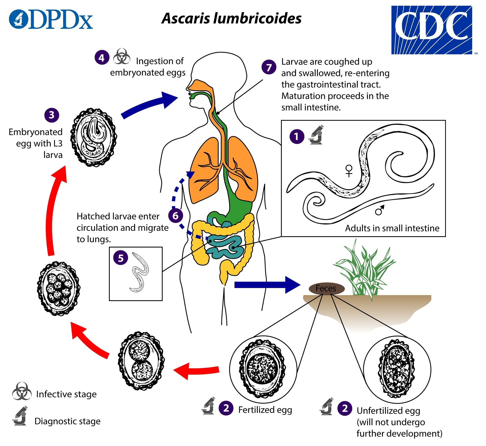

生活史:

- 感染：经口（土壤中1）感染期卵
- 成虫：寄生**小肠**
- 幼虫移行：小肠内孵出幼虫→肠壁静脉→门静脉→肝→右心→肺(泡2)→(支)气管咽→小肠(1),期间共蜕皮4次

致病:

**幼虫阶段:一过性肺炎**,症状有发热、咳嗽、痰中带血、哮喘、嗜酸性粒细胞增多
**成虫阶段:主要致病阶段**
- 掠夺营养和破坏肠粘膜影响吸收
- 超敏反应
- **并发症（钻孔习性）：喜酸怕碱**：肠梗阻、胆结石、胰腺炎等

治疗：丝虫海群生。其他：阿苯达唑，甲苯达唑。

实验诊断:
**虫卵：直接涂片法(常用)**，饱和盐水浮聚法，水洗沉淀法检查虫卵
**成虫，痰中幼虫**

易于传播的重要因素:生活史简单,雌虫产卵量大,虫卵抵抗力强,不良耕作及卫生习惯
药物**阿苯达唑（肠虫清）、甲苯达唑**

## 钩虫：十二指肠钩口线虫（Ancylostoma duodenale）美洲板口线虫(Necator americanus)  

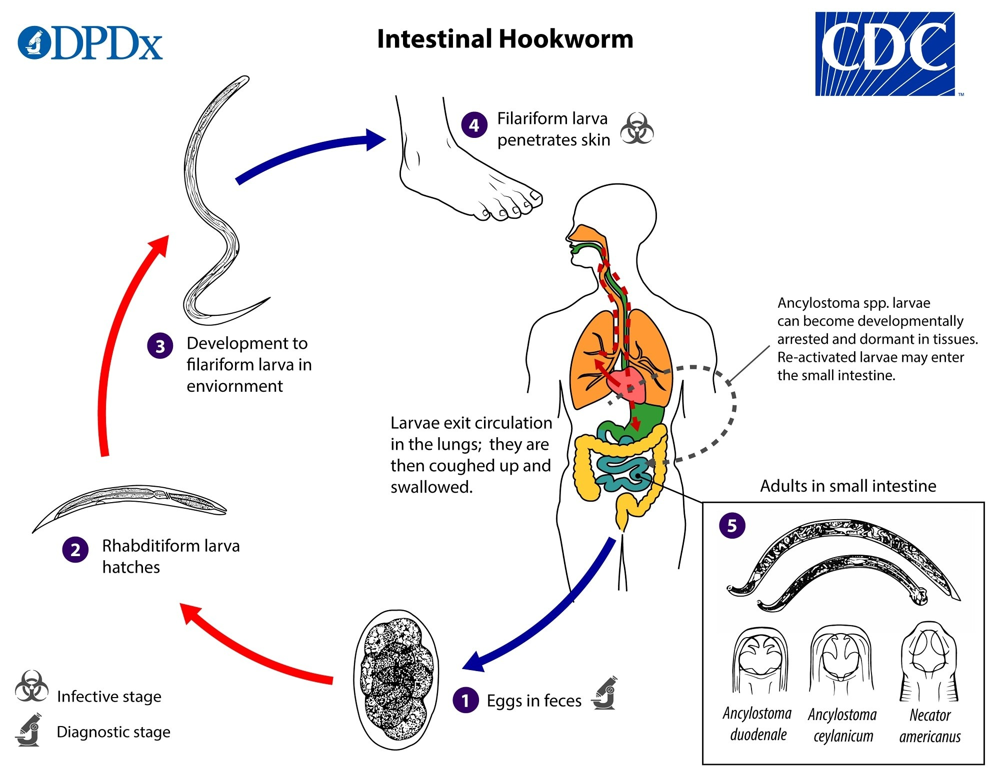

**掌握内容:**

- 生活史：
  - 感染途径：**丝状蚴（感染期蚴）**向温性，**主动钻入皮肤**（直接口吞，生肉，胎盘母乳），经血循环进入肺（**血肺移行**），再经**气管、咽进入小肠**
  - 十二指肠钩虫幼虫有"迁延移行现象"，指十二指肠钩虫的钩蚴经皮肤感染人体后，部分在进入小肠之前，可滞留于某些组织中达很长时间（此时，虫体发育缓慢或 “暂停发育” ），在受到某些刺激后，才陆续到达小肠发育成熟。
  - 成虫寄生在**小肠上段**
  - 终宿主：自然情况仅人；（转续宿主：A. d.-牛、羊、猪、兔、狮子和老虎； N. a.- 猴和猩猩）
  - 虫卵随粪便排出，在潮湿、荫蔽、通风、温暖环境下发育为丝状蚴
  - 主要通过皮肤感染，其他感染方式包括经口、经胎盘、母乳等

- 致病：
  - 幼虫
    - **钩蚴性皮炎**（粪毒，I型变态）
    - **一过性肺炎**
  - 成虫※：
    - 消化道症状
    - 低色素小细胞型贫血（※齿咬破肠粘膜损伤血管（不断更换啃咬部位），头腺分泌抗凝素，以血为食，血消化道排出；宿主蛋白质铁缺乏）
    - 异嗜症
    - 嗜酸性粒细胞增多症
    - （十二指肠钩虫）婴儿钩虫病（贫血）
    - 其他症状：生长发育障碍、闭经、阳痿、早产、死胎
  
- 实验诊断：
  - 粪便直接涂片法和 **（高效常用）饱和盐水浮聚法**查虫卵
  - **钩蚴培养**，改良加藤计算虫卵，痰中查钩蚴，胃镜查成虫
  - 免疫学

**熟悉内容:**  

- 形态特征：
  - 成虫呈C形或S形，有发达的口囊、咽腺和头腺，雄虫有交合伞和交合刺，两种钩虫可通过背辐肋和交合刺形态区分
  - 头腺1对：抗凝血酶原作 用，阻止宿主肠壁伤口的血液凝固，有利于钩虫的 吸血；
  - 咽腺3个：降低宿主肠壁的蠕动，有 利于虫体的附着
  - 排泄腺1对：抑制宿主血液的凝固
  - 虫卵卵圆形，卵壳薄透明，卵内细胞与卵壳间有明显空隙，排出时已分裂为2-4细胞
  - 两种钩虫主要的鉴别特征
  
## 毛首鞭形线虫（Trichuris trichiura）

掌握内容:
生活史: 成虫主要寄生在**盲肠**，感染:经口感染期卵
致病:掠夺营养和破坏肠粘膜影响吸收。轻度感染时一般无明显症状；严重感染可出现**直肠脱垂**
诊断：参考蛔虫。

## 蠕形住肠线虫(蛲虫)（Enterobius vermicularis） 
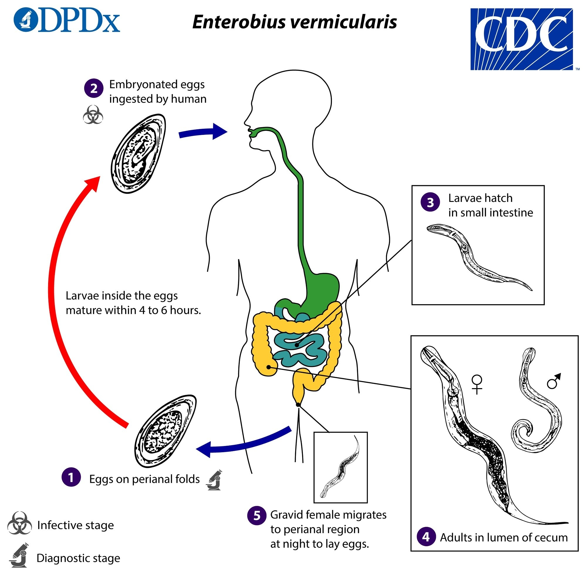

**掌握内容:**

- 生活史：
  - 成虫寄生在**盲肠、阑尾、结肠、直肠及回肠下段**
  - 雌虫在夜间(?)爬出肛门在**肛周**皮肤皱褶处**产卵**
  - 感染：感染期卵经口、呼吸道及肛门。主要通过自体感染(肛-手-口)传播，也可经呼吸道或逆行感染
  
- 致病：  
  - 损害肠黏膜、肛周瘙痒、阑尾炎、异位损害（蛲虫性泌尿生殖系统炎症）

- 实验诊断：
  - 透明胶纸拭擦法检查虫卵，在早晨洗澡或排便前进行

**熟悉内容:**

- 流行与防治原则：  
  - 世界性分布，感染率在儿童尤其是住宿学校儿童中很高，城市多于农村
  - 注意个人卫生如勤剪指甲、饭前便后洗手，加强环境消毒
  - 药物治疗可用阿苯达唑，外用药膏可缓解肛周瘙痒

## 斑/马：淋巴丝虫：班氏吴策线虫（Wuchereria bancrofti）马来布鲁线虫（Brugia malayi）

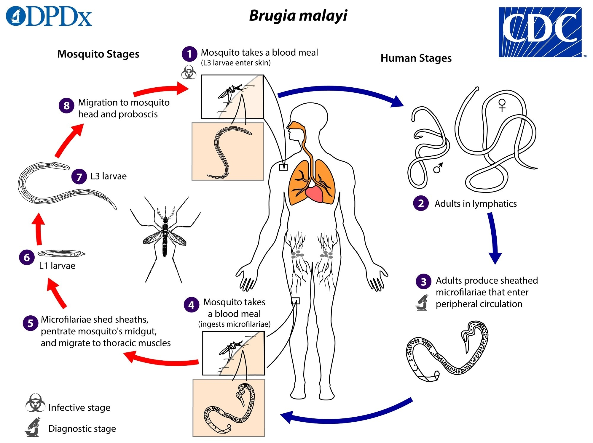
**掌握内容:**

- 生活史：
  - 卵胎生
  - 感染： **（班：淡色库蚊；马：中华按蚊）** 雌蚊叮刺吸血，**丝状蚴**（感染期幼虫）主要经皮肤感染
  - 成虫寄生淋巴：班：深部淋巴（下肢、阴囊、腹股沟、肾盂等部位），马：人猴猫四肢浅部淋巴系统
  - **微丝蚴夜现周期性**：微丝蚴在外周血液中夜多昼少，白天滞留在肺毛细血管中，夜晚出现于外周血液。高峰时间：W. b. 10PM-2AM，B. m. 8PM-4AM
  - 幼虫在蚊体内发育：腊肠期幼虫 → 丝状蚴，蜕皮两次，只发育，不增加数量

- 致病：
  - 微丝蚴血症：外周血可出现微丝蚴，症状不明显或有淋巴系统炎症和偶尔发热
  - 急性淋巴丝虫病
    - 淋巴**结炎**（腹股沟和股部淋巴结肿大）和**逆行**性淋巴**管炎**（流火）（出现丹毒样皮炎）
    - 精索炎、附睾炎、睾丸炎（班氏丝虫）
    - 丝虫热
  - 班氏丝虫病的三大并发症（慢性）：
    - 象皮肿（**生殖系统仅班氏；四肢均有**）（淋巴管阻塞导致高蛋白淋巴液流入周围组织，刺激组织增生、纤维化）
    - 鞘膜积液（精索、睾丸淋巴管阻塞，淋巴液流入鞘膜腔）
    - 乳糜尿（主动脉前或肠干淋巴结阻塞，乳糜液溢入尿中）
  - **隐性丝虫病**：低热、咳嗽、哮喘、**热带嗜酸性粒细胞增多**等，由宿主对微丝蚴抗原引起的Ι型超敏反应
  - 异位寄生（班氏多见）

- 实验诊断：
  - 外周血查微丝蚴：新鲜血滴检查法、厚血膜法（最常见）；乳糜尿 
  - 免疫诊断：皮试、检测抗体、检测抗原

海群生

## 旋毛形线虫（Trichinella spiralis）

卵胎生，生殖系统雌雄均为单管性。

**掌握内容:**

- 生活史：
    - 人感染：口食入含活**囊包幼虫**横纹肌肉类 
    - 发育过程：囊包幼虫在**小肠内脱囊发育为成虫**（？），交配产新生蚴进入血循环到达横纹肌形成囊包
    - 宿主转换：两个宿主（如猪→人）。保虫宿主：许多哺乳动物，自然疫源性

- 致病：
    - 侵入期（肠道期）：幼虫在小肠脱囊发育为成虫，导致肠粘膜炎症，出现发热、恶心、腹痛、腹泻等  
    - 幼虫移行期（肠外期）：幼虫移行到横纹肌，出现高热、**肌肉酸痛**，严重时呼吸、咀嚼、吞咽困难，心肌受累可致死
    - 成囊期（恢复期）：炎症介质和疤痕组织形成，轻度感染者逐渐恢复，重者可致命

- 实验诊断：
    - 询问吃生肉或加工不熟的肉的经历
    - 肌肉活检：取腓肠肌压片
    - 剩余肉镜检
    - 接种实验动物
    - 免疫方法

欧美国家发病率较高

# 吸虫概论

**掌握内容:**
- 吸虫生活史的一般规律：
  - 在吸虫的生活史中需要一种或两种中间宿主，**淡水螺类**是主要的第一中间宿主。多数种类有保虫宿主
  - 多数吸虫的感染阶段是**囊蚴，经口感染**；一些吸虫的感染阶段是**尾蚴，经皮肤感染**
  - 吸虫的生活史一般模式（肝吸虫）：卵（Egg）、毛蚴（Miracidium）、胞蚴（Sporocyst）、雷蚴（Redia）、尾蚴（Cercaria）、囊蚴（Encysted metacercaria）、童虫（metacercaria）、成虫（Adult fluke）
    - 肺吸虫、姜片虫（母/子雷蚴）
    - 血吸虫（母/子胞蚴，没有雷蚴，没有囊蚴）
  - 世代交替：胞蚴－雷蚴－尾蚴的生殖过程是无性生殖，有性生殖在成虫中进行
  - 卵只能在水中才能继续发育
**熟悉内容:**
- 吸虫的一般形态：
  - 成虫：背腹扁平，舌叶状（血吸虫丝状），大小因种而异，两侧对称，不分节 
  - 吸盘：口吸盘和腹吸盘；吸附和运动
  - 没有体腔
  - 体壁：
    - 皮层：外质膜，基质和基质膜 
    - 外环肌和内纵肌
    - 皮层细胞(Syncytium)
    - 功能：保护、营养吸收和感觉等
  - 消化系统：不完全消化管道：口、咽、食道、二分叉的肠支
  - 生殖系统：
    - 雌性：卵巢、输卵管、梅氏腺、卵模、卵黄腺和卵黄管、子宫、受精囊、劳氏管
    - 雄性：睾丸、输出管、输精管、储精囊、阴茎囊、前列腺、阴茎  
  - 排泄系统：火焰细胞和排泄管构成Protonephridial系统？？？？？？
  - 神经系统：咽两侧各有一神经节（神经中枢），两神经节各发出前后三条神经干，各神经干在不同的水平上有横索相连，形成阶梯状神经索

## 华支睾吸虫（肝吸虫）（Clonorchis sinensis）
**掌握内容:**

- 生活史：
  - 成虫寄生部位：肝胆管
  - 感染途径：食入**生**的或未充分烹饪的含**囊蚴**淡水鱼虾
  - 终宿主：人及食肉的哺乳动物  
  - 第一中间宿主：**淡水螺**（虫卵入水，被第一中间宿主吞食，毛胞雷尾逸出）
  - 第二中间宿主：**淡水鱼虾**（尾蚴侵入，体内发育囊蚴）
  - 保虫宿主：包括猫、狗、猪及鼠等（吃鱼的哺乳动物）
  - 在人体内的移行：**口 → 十二指肠 → 胆总管/血管/腹腔 → 胆管**
- 致病：
  - 华支睾吸虫病：主要是成虫寄居导致**肝受损、肝功能障碍**，病变主要发生于肝脏的**次级胆管**
    - 致病原因：虫体机械性刺激作用；虫体阻塞作用；虫体代谢产物和分泌物作用 
    - 胆管壁增生、胆管癌、胆结石；肝硬化、腹水、侏儒症
- 实验诊断：
  - 虫卵：
    - 从粪便中（约75%）：直接涂片法、改良加藤氏法、沉淀集卵法  
    - 十二指肠引流胆汁法（95.7%）
    - 口服胶囊法

吡喹酮 阿苯达唑

## 并殖吸虫(肺吸虫病)：卫氏并殖吸虫（Paragonimus westermani）斯氏狸殖吸虫（Pagumogonimus skrjabini）

**掌握内容:**

生活史：

- 第一中间宿主：**川卷螺**：**毛蚴侵入**螺类（如川卷螺）体内，经胞蚴、雷蚴发育为尾蚴。
- 第二中间宿主: **淡水蟹或蝲蛄**：尾蚴离开螺体侵入淡水蟹或蝲蛄内，包囊形成囊蚴。
- 感染阶段及人体感染方式: （终宿主：人及食肉哺乳动物；转续宿主：猪）食用生的或未充分烹饪的含**囊**蚴的淡水蟹或蝲蛄而被感染。
- **童虫在人体内的移行**see: 囊蚴在小肠脱囊为幼虫，幼虫侵入肠壁，进入腹腔，经肝、横膈进入胸腔，再侵入肺脏组织，亦可进入脑等其他部位。
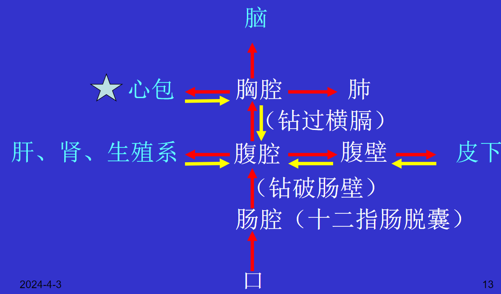
- 成虫寄主部位: 主要在肺部形成囊肿。
- 虫卵在外界的发育: 虫卵随带虫者或病人的粪便或痰液进入淡水中，在适宜条件下孵化为毛蚴。？？？？？？？？？

致病：
- **机械**性损伤，抗原**免疫**损伤。
- 急性期：幼虫移行窜扰：机械损伤、超敏。
- 慢性期：脓肿期、囊肿期和纤维疤痕期。
- 主要临床分型: 胸肺型（最常见）、腹型、皮下包块型、脑脊髓型、亚临床型，其他类型？？

实验诊断：
- 病原检查:
  - 虫卵：痰、粪便
  - 虫：皮下包块
- 免疫学检查: 皮试（初筛）、ELISA等。

吡喹酮治疗。

对斯氏狸殖吸虫（终宿主：果子狸，人体内很少发育为成虫；幼虫移行症：皮肤性、内脏型；吡喹酮）

## 布氏姜片吸虫(Fasciolopsis buski)

没有掌握内容

**熟悉内容:**

误食带有囊蚴的水生植物 或生水
终宿主：人和猪及其他哺乳动物
中间宿主：螺类（扁卷螺）
媒介植物：菱、荸荠、高笋等

- 轻度感染可无症状，带虫者
- 中度感染：消化道功能紊乱。成虫吸附在小肠上段的粘膜上，虫体较大，吸盘发达，吸附力强，造成机械性损伤；代谢产物被吸收后可引起超敏反应。
- 合并症：重度感染。肠梗阻，消瘦...，儿童侏儒症
- 诊断：粪便直接涂片法，虫卵浓集法（水洗沉淀法检出率高），粪便中有成虫，加藤虫卵计数，ELISA,IFA
- 流行：生食水生植物的习惯，中间宿主（扁卷螺）及媒介植物广泛存在，（人猪）粪污染水源
- 吡喹酮

## 日本血吸虫（Schistosoma japonicum）
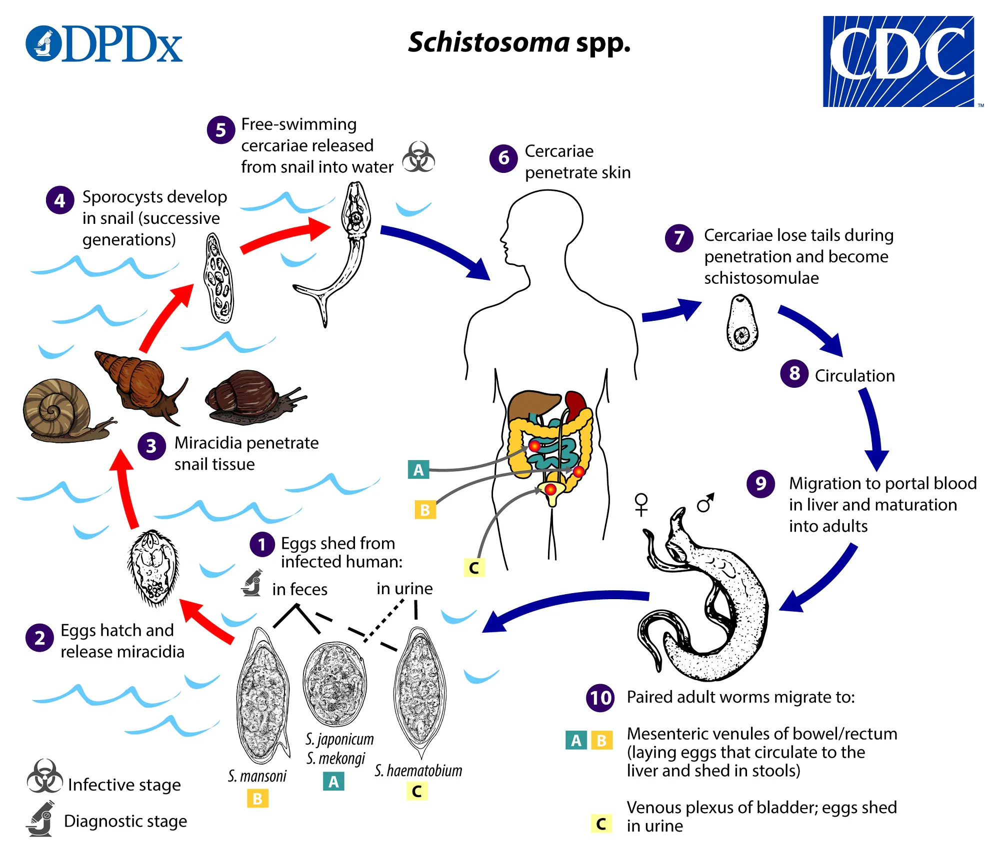
**掌握内容:**

- 生活史：
  - 雌雄异体，但通常呈合抱状态。
  - 感染：**皮肤**接触**尾蚴疫水**（向光性，向温性，主动钻入终宿主皮肤）
  - 童虫经皮下小血管或淋巴管进入静脉系统，经右心、肺、左心进入肠系膜动脉，毛细血管，再进入肝内门静脉，雌雄合抱并进一步发育，**成虫寄生于终宿主（人，牛）的门脉-肠系膜静脉**、发育成熟产卵。（**牛重要的保虫宿主**）
  - 虫卵大部分沉积于肠壁小血管内（60%），肝内门静脉（22%），很小一部分沉积于肺和脑（2%），还有一小部分随粪便排出体外（16%）。
    - 虫卵堆积在静脉使静脉内压增加。肠蠕动（推）、腹内压（压）和血管内压（挤）。卵内毛蚴分泌的蛋白酶透过卵壳，破坏血管壁，使周围组织发炎坏死。坏死组织向肠腔溃破，虫卵随坏死组织落入**肠腔**，随粪便排出体外。
  - 虫卵随粪便排出体外后在水中孵化成毛蚴，毛蚴在水中游动，感染**中间宿主钉螺**体内发育为尾蚴。
  - 初产期、空泡期、胚胎期、成熟期

- 致病：免疫性疾病
  - **尾蚴：尾蚴性皮炎**，表现为丘疹、瘙痒。
  - **童虫：肺部血管炎**，表现为发热、咳嗽、痰中带血、嗜酸性粒细胞升高。 
  - **成虫**：**机械损伤-静脉内膜炎**，免疫复合物疾病如肾小球肾炎。
  - **虫卵（最主要的致病因子）**：卵内毛蚴SEA再次刺激机体产生各种淋巴因子，引起L、M、E、N 聚集于虫卵周围产生Ⅳ变态反应——形成虫卵肉芽肿，可致肝纤维化，导致肝硬化、门脉高压。 Hoeppli phenomenon：虫卵周围出现许多浆细胞，浆细胞分泌抗体与抗原结合，在虫卵周围形成红色棒状辐射物，称为何博礼现象（III变态）。

- 临床表现：
  - **急**性血吸虫病（初次）：发热、咳血痰、腹痛、腹泻、粘液血便、肝脾肿大。
  - **慢**性血吸虫病（轻度重复感染）轻者无症状，有症状者：腹痛、腹泻、粘液血便、肝脾肿大、贫血、消瘦等。
  - **晚**期血吸虫病：巨脾、腹水、结肠增殖、侏儒等。
  - **异**位血吸虫病：肺（急性虫卵超敏）；脑（急性脑膜脑炎，慢性肉芽肿颅内占位病变）

- 实验诊断：
  - 病原检查：粪便：直接涂片法、毛蚴孵化法、改良加藤法。直肠粘膜组织活检查虫卵。 
  - 免疫诊断：皮内试验（IDT）、间接血凝（IHA）、酶联免疫吸附试验（ELISA）、环卵沉淀试验（COPT）、尾蚴膜反应（CHR）。

- 流行与防治原则：
  - 疫区分型：**湖沼、山丘、水网**
  - 传播途径三大环节：虫卵入水、钉螺孳生、接触疫水

- 吡喹酮，青蒿素

## 绦虫概论
- 线虫没有附着器官，只有线虫有假体腔
- 消化管道：线虫完整；吸虫不完整；绦虫没有（体表的微毛）
- 绦虫雌雄同体
**掌握内容:**
- 生活史: （孕节）虫卵---六钩蚴---中绦期(中间宿主)---成虫(终宿主)
- 绦虫在中间宿主体内发育的时期称为中绦期（metacestode）或续绦期，有多种幼虫形式。
  - 圆叶目: （孕节）虫卵 - 六钩蚴 - 囊尾蚴 - 似囊尾蚴 - 棘球蚴 - 成虫
  - 假叶目: 虫卵 - 钩球蚴 - 原尾蚴 - 裂头蚴 - 成虫 （曼氏迭宫绦虫）

**熟悉内容:**

- 绦虫的一般形态:
  1. 普遍特征
    - 多数成虫寄生在脊椎动物的小肠内；
    - 身体扁平，长带状，身体分节，两侧对称，大小因种而异
  2. 成虫形态！！
    (1) 头节：
      - 4个杯状吸盘，1个顶突，上有小钩 
      - 2个吸槽
    (2) 颈节：
      - 细短，不分节，由胚细胞组成，具生发功能  
    (3) 链体: 分节，3-4个或上千个
      - 未成熟节片（幼节）
      - 成熟节片（成节）：雌、雄性生殖器官各一套均成熟
      - 妊娠节片（孕节）：子宫极度发达，充满虫卵，其余器官退化
  3. 成虫内部结构
    (1) 体壁 ！！
      a. 皮层：微毛，基质，基膜
      b. 皮下层：环肌，纵肌，核周体，石灰小体
    (2) 神经系统：头节中有一神经节，发出6根纵行神经干，感觉末梢分布于皮质
    (3) 排泄系统：焰细胞，4根排泄管
    (4) 生殖系统：（成节雌、雄性生殖器官各一套均成熟）
      - 雄性生殖系统：睾丸，输出管，输精管，阴茎囊，射精管，阴茎  
      - 雌性生殖系统：生殖腔，阴道，输卵管，卵巢，卵模，卵黄腺，卵黄总管，梅氏腺，子宫

## 猪肉绦虫（Taenia solium）牛肉绦虫（Taenia saginata）

**掌握内容:**
- 生活史：
  - 成虫寄生部位：人小肠上段，人是两绦虫唯一的终宿主。
  - 虫卵（孕节）被中间宿主（猪/牛、人）**吞食**小肠消化液作用胚膜破裂**六钩蚴**逸出，钻小肠壁经血循环或淋巴到各处发育（主运动多的肌肉）成**囊尾蚴**
  - 人食用含囊尾蚴的生的或未充分烹饪的猪肉，囊尾蚴胆汁刺激翻出头节附着肠壁，发育成虫排卵。
- 致病：
  - 猪**囊尾蚴病**：吞食**虫卵**（孕节）
    - 三种感染方式：异体感染，自体外感染，自体内感染（呕入胃）
    - 皮下和肌肉囊尾蚴病（多数无症状，**皮下结节**，发热，嗜酸性粒细胞升高，**假性肌肥大**）
    - 脑囊尾蚴病：颅内高压、癫痫、精神症状（三大症状）
    - 眼囊尾蚴病
  - 猪带**绦虫病**：吃含**囊尾蚴**生猪肉：无症状或症状较轻
  - 牛带绦虫：一般无症状，肛周瘙痒，偶肠梗阻，透明胶纸拭擦法对于查虫卵较好

**熟悉内容:**

- 流行与防治：
  - 绦虫病：南瓜子，槟榔
  - 囊尾蚴：吡喹酮，手术

## 细粒棘球绦虫（Echinococcus granulosus）

**掌握内容:**

- 生活史：
  - 成虫形态：是医学寄生虫中最小的绦虫，长2-7 mm。头节略呈梨形，具有顶突（上有两圈小钩），４个杯状吸盘。颈节具生发功能。链体有１个幼节、１个成节、１个孕节。
  - 棘球蚴（包虫囊）结构及功能：球形，囊状，直径为2－35 cm。囊壁包括角质层和生发层。囊内容物包括**原头蚴、生发囊、子囊、孙囊、囊液**。
    - 原头蚴（原头节）由生发层产生，形似成虫的头节，但体积小、缺顶突腺。
    - 不育囊：无原头蚴生发囊的母囊
    - 棘球蚴液有抗原性
    - 棘球蚴砂：壁上脱落悬浮囊液的原头蚴、生发囊、小的子囊
  - 终宿主：**狗**，狼。中间宿主：**人、羊**、牛、骆驼
  - 人体感染棘球蚴的主要方式：经口摄入虫卵（孕节）被感染。
  - 棘球蚴的发育：六钩蚴在十二指肠内孵出，钻入肠壁小血管，至全身发育成棘球蚴
  - 棘球蚴被终宿主吞噬，囊内**原头蚴**胆汁刺激翻出顶突附着肠壁，发育成成虫排卵
  - 成虫寄生于**犬小肠上段**
- 致病：机械损害为主
  - **棘球蚴病（包虫病）**：通常寄生**肝、肺、腹腔**，有时可寄生在肾、脾，或脑，危害严重致命。**压迫邻近组织细胞**，引起寄生部位周围组织细胞的萎缩和坏死。
  - 临床表现：**棘球蚴液毒性过敏、囊破继发感染、局部压迫刺激**

- 首选手术摘除；阿苯达唑，吡喹铜

**熟悉内容:**

- 形态特征：虫卵与带绦虫卵相似，光镜下难以区别。
- 实验诊断：
  - 免疫学检查：皮内试验阳性；血清学试验如ABC-ELISA，ELISA，IHA等是重要的辅助诊断方法。
  - 病原检查：手术摘除棘球蚴是确诊方法；X-ray，CT，超声波检查，同位素扫描对诊断和定位有重要价值。
- 流行与防治：
  - 棘球蚴病在我国的分布：世界性分布，牧区为主要流行区，学龄前儿童最易感染。
  - 与畜牧业、皮毛加工业的关系：狗吞食含棘球蚴的羊内脏等是重要的流行因素。防治措施包括给狗定期驱虫，不喂生的动物内脏，注意个人卫生等。

## 曼氏迭宫绦虫（Spirometra mansoni）
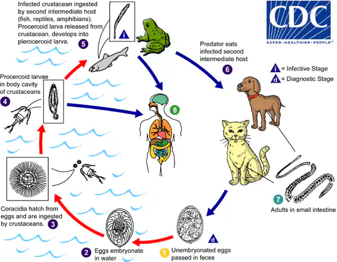
**掌握内容:**

- 生活史及感染阶段，人在其生活史中的角色：
  - 生活史
    - 虫卵：随粪便排出体外，入水发育→
    - **钩球蚴**，被第一中间宿主**剑水蚤**摄食，→
    - **原尾蚴**，剑水蚤被第二中间宿主如**蝌蚪（蛙）人**摄食，→
    - **裂头蚴**：蛙被终宿主如**猫、狗、人**等摄食，→
    - 成虫：小肠内发育为成虫。
    - **转续宿主如蛇、鸟、猪**等
  - 人在其生活史中的角色：人可作为第二中间宿主和终宿主。
  - 感染性
    - 饮用含**原尾蚴**感染的剑水蚤的水；原尾蚴可从皮肤侵入人体。）
    - 生吃含**裂头蚴**的蛙、蛇等；用被裂头蚴感染的蛙肉做湿敷剂，裂头蚴能钻穿皮肤使人感染
  - 很少寄生人，或症状较轻
- 裂头蚴病的临床分型：
  - 皮下 裂头蚴病
  - 眼 裂头蚴病
  - 脑脊髓 裂头蚴病
  - 口腔、颌面部 裂头蚴病
  - 内脏 裂头蚴病

**熟悉内容:**

- 简介成虫、裂头蚴和虫卵形态特征：
  - 成虫：头节指状，具有２个吸槽；颈节细长具生发功能；链体有1000节片，成节和孕节相似；雌雄生殖孔和子宫孔位于节片的中部，卵黄腺滤泡状，子宫位于卵巢前。
  - 裂头蚴：乳白色，带状，约300 mm长，头端较膨大，尾端较细，体前端无吸槽，中央有一明显凹陷，头节与成虫的相似，身体不分节。
  - 卵：椭圆形，浅灰褐色，卵壳较薄，一端有卵盖，内有一个卵细胞和多个卵黄细胞。

**学时分配:** 4

## 微小膜壳绦虫（Hymenolepis nana）
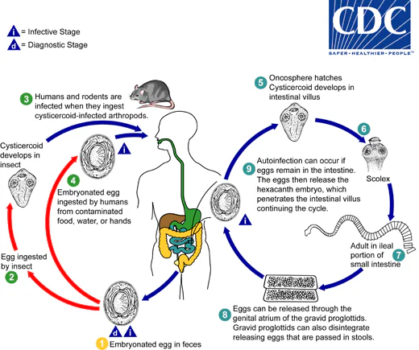
**熟悉内容:**

- 简介形态、生活史的特征及自体感染现象、致病与病原诊断。

成虫寄生在人和啮齿类小肠
感染方式、阶段、途径：口：卵，似囊尾蚴
- 直接感染（不经中间宿主）：虫卵→六钩蚴→似囊尾蚴（肠绒毛）→成虫
- 自体内感染（不经中间宿主）：虫卵在肠腔内停留
- 间接感染（需中间宿主）：虫卵（人粪被中间宿主蚤类幼虫吞噬）→六钩蚴→似囊尾蚴（蚤类幼虫血腔）→（人、鼠误食）成虫

通常无症状、消化不良等。
查粪便中的虫卵
吡喹酮

## 原虫概论
**掌握内容:**
- 生理特征：运动与摄食、生殖方式的类型。
  - 运动：伪足、鞭毛、纤毛
  - 摄食：渗透、胞饮、吞噬
  - 无性生殖: 二分裂、多分裂、出芽生殖
  - 有性生殖：接合生殖、配子生殖

**熟悉内容:**
- 形态特征：胞膜、胞质及细胞器、胞核及类型。
  - 细胞膜（表膜、质膜）：使虫体保持一定的形状, 具有抗原性；参与虫体的营养、排泄、运动、感觉、侵袭及逃避宿主免疫效应等活动
  - 细胞质：由基质（内质和外质）、细胞器、内含物组成
  - 细胞器：普通细胞器（线粒体、高尔基复合体、内质网、溶酶体等）和特殊细胞器（伪足、鞭毛、纤毛、胞口、胞咽、胞肛、顶端复合体、丝状伪足等）
  - 胞核类型：泡状核和实质核

- 生活史类型
  - 人际传播型： 
    - 直接：滋养体－滋养体 （阴道毛滴虫）
    - 间接：包囊－滋养体－包囊（溶组织内阿米巴； 蓝氏贾第鞭毛虫）
  - 人与动物间传播型（循环传播型） ： 人----脊椎动物（刚地弓形虫）
  - 虫媒传播型： 人----无脊椎动物（疟原虫、杜氏利什曼原虫）

- 致病特点
  - 增殖致病：贾第虫100万个/cm2、疟原虫
  - 播散能力：个体微小, 带至全身各处
  - 毒素致病：原虫的代谢、分泌物等
  - 机会致病：弓形虫

- 根据运动细胞器分类：
  - 叶足纲——溶组织内阿米巴
  - 动鞭纲——杜氏利什曼原虫、阴 道毛滴虫、蓝氏贾第鞭毛虫
  - 孢子纲——弓形虫、疟原虫
  - 纤毛纲——结肠小袋纤毛虫
  
## 阴道毛滴虫（Trichomonas vaginalis）

**掌握内容:**

- 滋养体的寄生部位、增殖与传播：
  - 寄生部位
    - 女性：阴道，尿道
    - 男性：尿道，前列腺等
  - 分裂方式：纵二分裂，**仅有滋养体期**
  - 传播途径：直接或间接接触
- 滴虫性阴道炎、尿道炎：
  - 阴道炎：阴道分泌物增多，外阴搔痒
  - 尿道炎：尿频、尿急、尿痛
  - 前列腺炎
- 滴虫生活史及引起的临床疾病：
  - 直接或间接接触（性传播，公共泳池，租用泳衣，公共马桶）
  - 致病机制：阴道自净作用受到破坏，pH值由酸性变为中性或碱性，继发性细菌感染
  - 病理：阴道粘膜充血、水肿，上皮细胞变性脱落

**熟悉内容:**

- 生理盐水涂片法及培养法检查：取尿液沉淀物、前列腺液涂片；查阴道分泌物（直接涂片或染色、肝浸液培养基培养）
- 甲硝唑

## 蓝氏贾第鞭毛虫（Giardia lamblia）
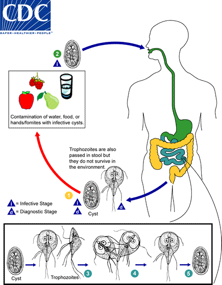

**掌握内容:**

- 生活史特征：
  - **成熟四核包囊**（感染期）随污染食品、水，经口食入
  - **滋养体**（繁殖阶段）：十二指肠脱囊，寄生于十二指肠（吸盘吸附）、胆囊，纵二分裂繁殖
  - **包囊**（传播阶段，外界抵抗力强）：回肠下段或结肠成囊，随粪便排出，污染食物和饮水
- 带虫状态及急慢性期表现：
  - 带虫者：13~17%
  - 急性期：发热、乏力、恶心、厌食、腹痛、腹泻，恶臭水样便，上中腹痉挛疼痛，吸收不良，脂肪泻等
  - 慢性期：
    - **胆囊炎或胆管炎**
    - 表现为周期性稀便，反复发作，大便甚臭，病程可长达数年
    - 儿童患者可由于腹泻、脂肪泻，引起贫血等营养不良，导致生长滞缓

**熟悉内容:**
- 实验诊断：粪便检查（滋养体：生理盐水涂片；包囊：碘液涂片）、小肠液检查、小肠活体组织检查、免疫诊断（ELISA、IFA、CIE等）
- 甲硝唑（灭滴灵）、替硝唑

## 溶组织内阿米巴（Entamoeba histolytica）
**掌握内容:**
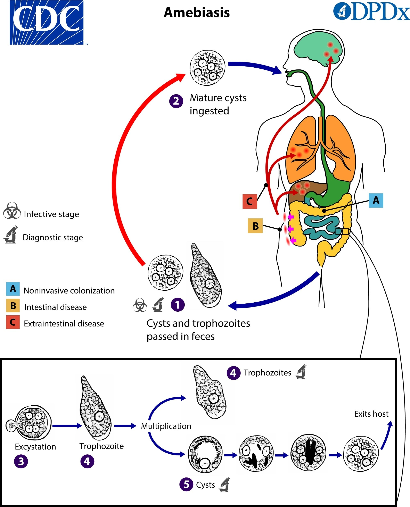
- 形态及生活史特征
  - 基本生活史过程：包囊 滋养体 包囊
  - 滋养体：组织型大滋养体和肠腔型小滋养体
  - 包囊：单核包囊、双核包囊、四核包囊（具传染性）
  - 生活史：四核包囊经口感染，在小肠内脱囊为肠腔性小滋养体，寄生于结肠，以二分裂增殖。包囊随粪便排出体外发育；肠腔型小滋养体随稀水样便排出死亡；侵入组织的组织性大滋养体侵**肝肺脑**。人为适宜宿主。
- 致病（组织型大滋养体）：
  - 致病机制：细菌增强阿米巴毒力，特定株的致病力决定是否侵入组织。阿米巴凝集素（介导吸附肠上皮）、穿孔素、半胱氨酸蛋白酶破坏宿主组织，吞噬死的宿主细胞，免疫力下降
  - 病理变化：滋养体：**烧瓶样溃疡**，好发于盲肠、阑尾（乙状结肠，升结肠，回肠）
  - 临床表现：
    - 带虫者
    - 肠阿米巴病
      - 阿米巴结肠炎：轻度间歇性腹泻，急性阿米巴痢疾
      - 并发症：阿米巴肿、中毒性巨结肠、阿米巴腹膜炎
    - 肠外阿米巴病（血行转移；阿米巴肝肺脑脓肿，皮肤尿道子宫阿米巴病）
- 实验诊断：
  - 粪便：
    - 急性：生理盐水涂片查滋养体（夏科雷登结晶）
    - 慢性/带虫者：碘液涂片/硫酸锌漂浮/甲醛乙醚沉淀查包囊
  - 组织检查
    - 肝脓肿穿刺液查滋养体
    - 乙状结肠镜
  - 人工培养：Robinson' culture medium 
  - 免疫诊断：ELISA，IFA，IHA等
  - 影像：B超，CT,MRI
  - 核酸特异引物

**熟悉内容:**
- 理化及生物因素对阿米巴发育、增殖的影响。
- 流行因素及防治原则：传染源、传播方式。
  - **传染源：慢性病人及带虫者**
  - 传播途径：包囊污染食物、饮水
  - 防治：控制传染源、切断传播途径、个人及环境卫生
  - **肠（外）阿米巴：甲硝唑，替硝唑**；
  - **带虫者：巴龙霉素、喹碘方**

## 结肠内阿米巴（Entamoeba coli）

盲肠结肠，不含红细胞，不治病。

**熟悉内容:**
- 包囊较大，核数1-8个，拟染色体呈草束状
- 致病性自生生活阿米巴的感染方式和致病特点。

## 刚地弓形虫（Toxoplasma gondii）

**掌握内容**
弓形虫生活史特点，先天性感染和婴儿弓形虫病。
弓形虫流行的因素 与特点 。
弓形虫感染阶段及传播途径。

- 假包囊(速殖子)（主要致病阶段）
- 包囊(缓殖子)
- 卵囊/囊合子：2孢子囊：4(子孢子)
- 裂殖体
- 配子体

- 中间宿主：人、动物及猫科动物。寄生除红细胞外的各种有核细胞内
- 终宿主：猫科动物。寄生小肠上皮。
- 2个宿主，世代交替

- 感染期：**假包囊、包囊、（滋养体）、卵囊**（形态学看清楚）
- 先天经胎盘；后天经口、皮肤黏膜伤口、输血、器官移植

治病
- 先天性弓形虫病：流产，死产
- 婴儿弓形虫病：脑、眼、全身性表现
- 获得性弓形虫病
- 操纵假设

弓形虫病广泛流行的原因
- 感染阶段多，虫体多个生活史期都具有感染性
- 弓形虫对中间宿主的选择极不严格，中间宿主广， 家禽家畜均易感
- 可在终宿主之间、中间宿主之间、终宿主与中间宿 主之间互相传播
- 包囊可长期生存在中间宿主内
- 终宿主排放卵囊量大，且对外界环境抵御力强

## 杜氏利什曼原虫※（Leishmania donovani）

**掌握内容:**

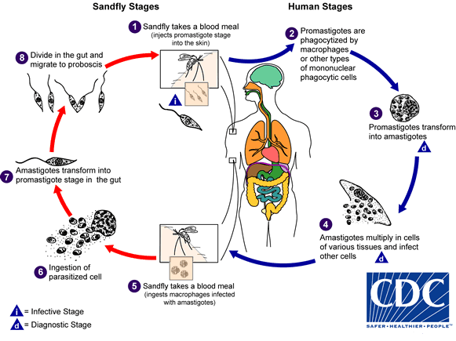
- 生活史：
  - **人巨噬**细胞：**无**鞭毛体
  - **雌白蛉**体内发育：**前**鞭毛体
  - 感染阶段及方式：前鞭毛体，雌白蛉吸血
  - 寄生部位：巨噬细胞

- 致病：
  - 病理：无鞭毛体在巨噬细胞里增殖，造成巨噬细胞大量破坏和增生。受累器官：肝、脾、骨髓、淋巴结等
  - 内脏利什曼病(visceral leishmaniasis)（黑热病三大症状）：**长期不规则发热、肝脾淋巴结肿大、全血细胞贫血**、**白蛋白/球蛋白比例倒置、蛋白尿和血尿、鼻和齿龈出血、并发症**
  - 我国黑热病的特殊表现型：**黑热病后皮肤**利什曼病、**淋巴结型**黑热病、**皮肤**利什曼病

- 实验诊断：
  - 病原学检查（其他都是无鞭毛体）
    - 穿刺物**涂片法**（骨髓、淋巴结、脾）查无鞭毛体
    - 穿刺物培养法**NNN培养**基查**前**鞭毛体????
    - 穿刺物**接种动物法**、接种后取动物肝、脾检查， 查无鞭毛体
    - 外周血涂片
    - 皮肤活检组织检查
  - 免疫诊断：ELISA、IHA等；
  - 分子生物学检查法：PCR、DNA探针

- 流行：人源型（平原型）、犬源型（山丘型）、自然疫源型（荒漠型）

- 锑剂，戊烷脒，miltefosine米替福星

**熟悉内容:**

- 形态特征：
  - 无鞭毛体：卵圆形、虫体很小（2-3μm）、有一较大圆形核、动基体位于核旁细小杆状、高倍镜下可见基体和根丝体
  - 前鞭毛体：虫体呈梭形、大小为10～20μm×1.5-4μm、核位于虫体中部、动基体在前部、基体发出一鞭毛（长与虫体相近，弯曲）、在培养基内常以虫体前端聚集成团（排列成菊花状）
- 流行与防治原则：
  - 传染源：病人、病犬、感染犬、野生动物
  - 传播媒介：白蛉
  - 防治：治疗病人、控制病犬、消灭白蛉、加强个人保护

## 间日疟原虫（Plasmodium vivax）

- 形态特征：
  - 环状体：虫体胞质较少呈环状，中间为大空泡，核位于虫体一侧，颇似戒指的红宝石。早期滋养体又称为环状体。
  - 大滋养体：虫体增大，伸出伪足，胞质增多，出现疟色素。红细胞胀大，颜色变淡，并出现能染成淡红色的小点，称薛氏小点。
  - 裂殖体：未成熟裂殖体虫体变圆，空泡消失，核开始分裂。成熟裂殖体裂殖子12～24个，平均16个，排列不规则，虫体占满胀大了的红细胞，疟色素集中成堆。
  - 雌雄配子体：间日疟原虫配子体呈圆形或椭圆形，疟色素均匀分布于虫体内，核1个。雌配子体虫体较大，胞质致密，色深蓝，核小致密，深红色。雄配子体虫体较小，胞质浅蓝，核大疏松，淡红色。

- 生活史：
  - 感染：雌按蚊吸血、输血 **子孢子**。人和按蚊世代交替
  - 致病：**红内期疟原虫**，肝细胞、红细胞寄生。
  - 诊断：红内期疟原虫
  - 人体内：肝细胞内裂体增殖（红外期），红细胞内裂体增殖和配子体形成（红内期）。
  - 蚊体内：蚊胃腔中配子生殖，蚊胃壁上孢子生殖。
  - 恶性疟原虫的大滋养体、成熟裂殖体一般不出现在外周血。

- 致病：
  - 疟疾的潜伏期：
    - 经蚊虫叮咬，潜伏期=红外期+几个红内期裂体增殖
    - 经输血感染，潜伏期=几个红内期裂体增殖
    - 影响因素：与虫种、虫株、感染虫量、宿主免疫力和服用抗疟药物有关。  
  - 疟疾的发作：红内期疟原虫裂体增殖，红细胞破裂，**疟色素和代谢产物**进入血液，引起的**周期性寒颤、高热、大汗**，释放的一部分裂殖子进入其他红细胞增殖，引起新一轮红细胞裂解和症状；另一部分裂殖子被单核-吞噬细胞系统消灭；还有部分裂殖子发育为配子体。与**红内期裂体增殖周**期一致。
  - 贫血：疟原虫直接破坏、脾亢进（主要原因）、骨髓红细胞生成障碍、免疫溶血、不能再利用结合疟色素的铁
  - 脾肿大：早期主要由于脾充血、单核吞噬细胞增生；长期不愈或反复感染，导致包膜增厚、反复感染引起纤维组织增生。
  - 热带巨脾综合征：肝大、门脉高压。
  - 再燃recrudescence：疟疾病人初发停止后，无再感染，由于体内残存的红内期疟原虫在一定条件下大量繁殖引起的疟疾发作
  - 复发relapse：疟疾初发停止后，红内期疟原虫已被消灭，无再感染，经过一段时间，又出现疟疾发作。子孢子休眠学说（P.v, P.o）。
  - 恶性疟和三日疟无迟发性子孢子，仅再燃。
  - 凶险型疟疾
    - 多由恶性疟原虫引起，间日疟和诺氏疟也可
    - 多发生于流行区儿童、无免疫力的旅行者和流动人口
    - 包括脑型疟疾、急性肾衰竭、呼吸窘迫综合征和严重贫血等
    - CD8+ T细胞介导免疫病理和感染疟原虫红细胞的机械堵塞
  - 疟疾性肾病
    - 多见于**三日疟**病人长期未愈者，**非洲儿童**居多
    - **III型变态反应**
    - **抗原抗体复合物沉积于肾小球基底膜激活补体**
    - **肾病综合症**：水肿、腹水、蛋白尿、 高血压，可致肾衰
  - 大纲没有的：
    - 胃肠型疟疾、孕妇疟疾
    - 输血性疟疾：输入含疟原虫的血液引起。特点是潜伏期短，只有红内期，治愈后不复发。
      - 肾脏移植：如果捐献者有原虫血症，可导致受捐者感染疟疾。
      - 混用注射器：吸毒者混用注射器可能感染疟疾。
  - 大纲有PPT无
    - 黑尿热。
    - 先天性感染及婴幼儿疟疾

- 免疫：
  - 先天免疫：西非黑人Duffy血型阴性个体抵抗间日疟原虫感染。血红蛋白HS型，G6PD缺 先天抵抗。
  - 获得性免疫：具种、株、期特异性。包括体液免疫和细胞免疫。
  - 带虫免疫：人体感染疟原虫后，产生抗疟原虫免疫力，能抵抗同种疟原虫的再感染，但不能消除体内全部疟原虫，感染者血液内原虫密度保持低水平状态。
  - 免疫逃避：疟原虫通过改变寄生部位、抗原变异、改变免疫应答等机制逃避宿主免疫。

- 实验诊断：
  - 病原检查：厚薄外周血膜涂片染色镜检。
    - 厚血膜涂片原虫集中**易发现**，红细胞已溶难鉴别
    - 薄血膜涂片形态清晰完整可**辨认**，但虫数较少易漏检。
  - 血清学检查：间接免疫荧光试验(IFA)、间接血凝试验(IHA)、酶联免疫吸附试验(ELISA)等。

氯喹、咯萘啶、青蒿素治红内期裂体增殖

**熟悉内容**
生理：裂殖子侵入红细胞的过程，营养代谢的特点及疟原虫对红细胞的影响。

## 恶性疟原虫（Plasmodium falciparum）
- 形态特征：
  - 环状体：环纤细，约为红细胞直径的1/5，核1-2个，常位于红细胞边缘，红细胞常含2个以上原虫。  
  - 大滋养体：体小结实，圆形，不活动，疟色素集中一团，黑褐色，原虫此时开始集中在内脏毛细血管，一般不出现在外周血。
  - 成熟裂殖体：裂殖子8～36个，通常18～24个，排列不规则，疟色素集中成一团，虫体占红细胞体积的2/3至3/4，一般不出现在外周血。
  - 雌配子体：新月形，两端较尖，核致密，深红色，常位于中央，疟色素黑褐色，分布于核周围。
  - 雄配子体：腊肠形，两端钝圆，胞质色蓝而略带红，核疏松，淡红色，位于中央，疟色素黄棕色，小杆状，在核周围较多。

- 致病：
  - 凶险型疟疾：多由恶性疟原虫引起，包括脑型疟疾、急性肾衰竭、呼吸窘迫综合征和严重贫血等。多发生于流行区儿童、无免疫力的旅行者和流动人口。CD8+T细胞介导免疫病理和感染疟原虫红细胞的机械堵塞是主要发病机制。   
  - 黑尿热：溶血性贫血的一种，多见于服用抗疟药物伯氨喹后。
  - 先天性感染及婴幼儿疟疾：怀孕妇女感染恶性疟原虫，可引起胎儿宫内发育迟缓、流产、早产、死胎等；婴幼儿感染疟疾病情较重。

